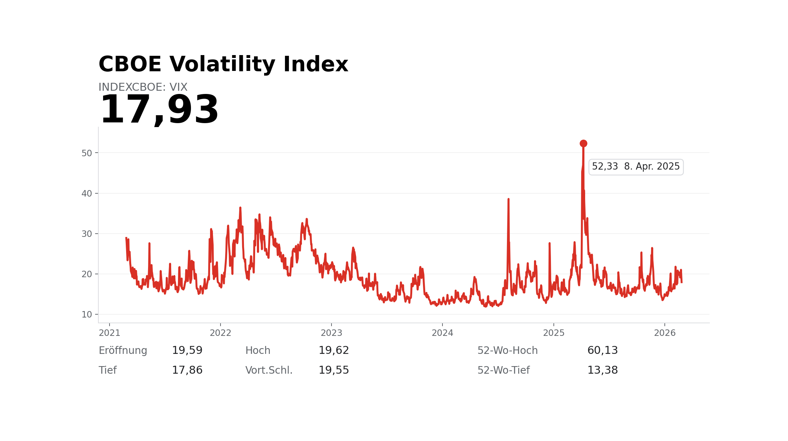
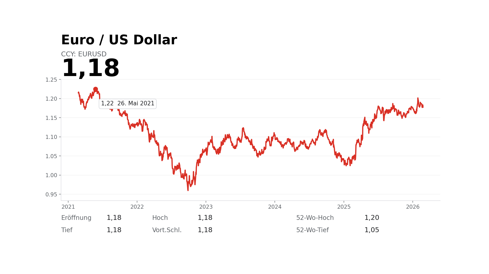

# Daily Report

_Generated: **2026-02-25 22:58 CET**_

## 1) Market recap & positioning

**Executive summary:**

Headline: AI-linked earnings revived the tech bid even as mixed guidance from Salesforce underscored how selective this season remains. The Nasdaq 100 rose 1.4% and the S&P 500 gained 0.8% while the VIX slid 8.3%, extending the past few weeks’ choppy, earnings-driven tape (NDX -1.5% over 1M). Biggest movers on the watchlist were IONQ +6.2%, Netflix +6.0% and Robinhood +5.6%, while MercadoLibre fell 8.1%.

**Key tape (multi-horizon):**

| Instrument       | Last      | 1D                                         | 7D                                          | 1M                                          | 3M                                          | 6M                                           |
| :--- | ---: | ---: | ---: | ---: | ---: | ---: |
| Nasdaq 100       | 25,329.04 | +1.41% | +1.73%  | -1.49%  | +0.36%  | +8.17%   |
| S&P 500          | 6,946.13  | +0.81% | +0.94%  | -0.06%  | +1.96%  | +7.52%   |
| QQQ              | 616.68    | +1.45% | +1.80%  | -1.40%  | +0.39%  | +8.11%   |
| SPY              | 693.15    | +0.84% | +1.00%  | +0.06%  | +1.98%  | +7.46%   |
| STOXX Europe 600 | 633.47    | +0.69% | +0.76%  | +3.92%  | +10.17% | +15.15%  |
| DAX              | 25,175.94 | +0.76% | -0.40%  | +0.97%  | +5.92%  | +5.33%   |
| CAC 40           | 8,559.07  | +0.47% | +1.54%  | +5.26%  | +5.67%  | +11.10%  |
| FTSE 100         | 10,806.41 | +1.18% | +1.12%  | +6.48%  | +11.48% | +17.62%  |
| VIX              | 17.93     | -8.29% | -8.61%  | +11.02% | +4.30%  | +16.73%  |
| EUR/USD          | 1.18      | +0.17% | -0.32%  | -0.38%  | +1.82%  | +1.13%   |
| WTI Crude        | 65.52     | -0.17% | +0.51%  | +8.07%  | +11.71% | +2.36%   |
| Gold             | 5,187.60  | +0.62% | +4.03%  | +2.12%  | +24.55% | +49.34%  |
| Silver           | 90.10     | +3.02% | +16.24% | -21.71% | +70.27% | +124.13% |
| Coffee           | 284.40    | -1.34% | -1.10%  | -20.17% | -30.89% | -28.34%  |
| Cocoa            | 3,057.00  | +2.00% | -5.24%  | -29.69% | -38.77% | -59.96%  |
| Bitcoin          | 68,960.53 | +7.62% | +3.82%  | -21.87% | -24.46% | -36.39%  |

**Macro charts (5Y):**

<table><tr><td style='padding-right:12px;'></td><td></td></tr></table>

## 2) Biggest movers (≥ 4%)

**Session gainers:**

| Ticker           | pct    |
| :--- | ---: |
| IONQ (Quantum)   | +6.23% |
| NFLX (Media)     | +5.97% |
| HOOD (Brokerage) | +5.64% |
| QBTS (Quantum)   | +5.31% |
| DASH (Services)  | +5.28% |
| AMAT (Equipment) | +4.50% |
| CEG (Power)      | +4.22% |
| PLTR             | +4.15% |

**Session losers:**

| Ticker        | pct    |
| :--- | ---: |
| MELI (E-comm) | -8.05% |

**After-hours gainers:** _None ≥ 4%_

**After-hours losers:** _None ≥ 4%_

## 3) Earnings next 14 days (watchlist)

_Upcoming earnings dates for your 44-ticker watchlist._

| Ticker            | Earnings Date   |   Days |
| :--- | ---: | ---: |
| IONQ (Quantum)    | 2026-02-25      |      0 |
| NU (Fintech)      | 2026-02-25      |      0 |
| NVDA (Compute/IP) | 2026-02-25      |      0 |
| SNPS (EDA)        | 2026-02-25      |      0 |
| INSW (Tanker)     | 2026-02-26      |      1 |
| MUV2 (Insurance)  | 2026-02-26      |      1 |
| NAT (Tanker)      | 2026-02-26      |      1 |
| QBTS (Quantum)    | 2026-02-26      |      1 |
| SMR (SMR)         | 2026-02-26      |      1 |
| VST (Power)       | 2026-02-26      |      1 |
| FRO (Tanker)      | 2026-02-27      |      2 |
| ANF (Brands)      | 2026-03-04      |      7 |
| AVGO (Compute/IP) | 2026-03-04      |      7 |

## 4) Technical triggers

### 4) Watchlist emerging chart trends

_Logic: score each ticker by stage (CONFIRMED=3, EARLY=1) × direction (BREAKOUT=+1, BREAKDOWN=-1), then aggregate by category._

| Category | Bias | VALID↑ | VALID↓ | CONF↑ | CONF↓ | EARLY↑ | EARLY↓ |
| :--- | :--- | ---: | ---: | ---: | ---: | ---: | ---: |
| AI compute & semis (incl. EDA) | Mixed | 0 | 0 | 0 | 0 |
| Big Tech platforms | Bullish | 1 | 0 | 0 | 0 |
| Consumer & retail (incl. luxury) | Mixed | 0 | 0 | 0 | 0 |
| Fintech & financials | Mixed | 0 | 0 | 0 | 0 |
| Healthcare | Bullish | 1 | 0 | 0 | 0 |
| Energy & Nuclear | Mixed | 0 | 0 | 0 | 0 |
| Quantum | Mixed | 0 | 0 | 0 | 0 |
| Venezuela Oil | Mixed | 0 | 0 | 0 | 0 |

### 4A) Early callouts (~80% complete)

_Close enough to pre-plan. “Close enough” = within 0.5 ATR of the trigger (neckline/boundary). No SOFT tier — anything not CONFIRMED stays in EARLY._

**NEW (today):**

_None_

**ONGOING:**

_None_

### 4B) Confirmed breakouts / breakdowns (watchlist + MSCI World)

_Includes **CONFIRMED** only: close beyond trigger by ≥0.5 ATR AND Volume ≥1.25×AvgVol(20) AND CLV ≥+0.70 (breakout) / ≤−0.70 (breakdown). Categories keep watchlist custom buckets; non-watchlist MSCI names use S&P 500 11-sector labels._ 

**NEW (today):**

| Name of Company     | Ticker        | Country       | Category   | Signal                 |   Close |   Threshold |   Dist(ATR) | Day%   | Chart                                        |
| :--- | :--- | :--- | :--- | :--- | ---: | ---: | ---: | ---: | :--- |
| MERCADOLIBRE INC    | MELI (E-comm) | United States |            | CONFIRMED_IHS_BREAKOUT | 1767.71 |   2314.77   |        1.67 | -8.05% | [chart](img/MELI_CONFIRMED_IHS_BREAKOUT.png) |
| DOCUSIGN INC        | DOCU          | United States |            | CONFIRMED_IHS_BREAKOUT |   43.26 |     67.6    |        7.59 | +0.96% | [chart](img/DOCU_CONFIRMED_IHS_BREAKOUT.png) |
| NUTANIX INC CLASS A | NTNX          | United States |            | CONFIRMED_IHS_BREAKOUT |   38.44 |     42.0232 |       21.52 | +1.53% | [chart](img/NTNX_CONFIRMED_IHS_BREAKOUT.png) |
| NVO                 | NVO (Pharma)  | United States |            | CONFIRMED_IHS_BREAKOUT |   38.16 |     36.0677 |       53.49 | -1.11% | [chart](img/NVO_CONFIRMED_IHS_BREAKOUT.png)  |

**ONGOING:**

| Name of Company          |   Ticker | Country   | Category   | Signal                      |   Close |   Threshold |   Dist(ATR) | Day%   | Chart                                               |
| :--- | :--- | :--- | :--- | :--- | ---: | ---: | ---: | ---: | :--- |
| MURATA MANUFACTURING LTD |     6981 | Japan     |            | CONFIRMED_RECT_TOP_BREAKOUT |    4223 |     3377.85 |        8.12 | +4.40% | [chart](img/6981.T_CONFIRMED_RECT_TOP_BREAKOUT.png) |

### 4C) Validated breakouts / breakdowns (3-session anti-whipsaw)

_Includes **VALIDATED** only: breakout/breakdown occurred **3 sessions ago** AND for the breakout day + the next 3 sessions (incl. today) ALL 3 confirmation gates held on **each** session: (1) CLV >= +0.70 / <= -0.70, (2) Volume >= 1.25x AvgVol(20), (3) Close beyond trigger by >= 0.5 ATR(14)._

**NEW (today):**

_None_

**ONGOING:**

_None_

## 5) Needle-moving catalysts (RSS digest)

_Linked digest for drill-down._

- [Nvidia reports earnings beat as AI boom pushes data center revenue up 75%](https://www.cnbc.com/2026/02/25/nvidia-nvda-earnings-report-q4-2026.html) — CNBC Top News
- [House Dems project midterm optimism at annual policy retreat following State of the Union](https://www.cnbc.com/2026/02/25/state-of-the-union-house-democrats-midterms-retreat.html) — CNBC Top News
- [Salesforce shares sink on mixed guidance as company commits $50 billion for buybacks](https://www.cnbc.com/2026/02/25/salesforce-crm-q4-earnings-report-2026.html) — CNBC Top News
- [Urban Outfitters’ once-struggling namesake stores are now driving its sales gains](https://www.marketwatch.com/story/urban-outfitters-once-struggling-namesake-stores-are-now-driving-its-sales-gains-a841972d?mod=mw_rss_topstories) — MarketWatch Top Stories
- [Former Alphabet 'moonshot' robotics company Intrinsic is folding into Google](https://www.cnbc.com/2026/02/25/alphabet-robotics-software-intrinsic-google-ai.html) — CNBC Top News
- [Nvidia rallies on robust earnings powered by AI investment boom](https://www.ft.com/content/f4cda766-5650-4a97-a84f-24d3cfbeddd6) — Financial Times
- [Are collectibles a viable asset class? The buyer of the $16.5 million Pokémon card thinks so](https://www.cnbc.com/2026/02/25/pokmon-card-winner-scaramucci-says-collectibles-are-asset-class.html) — CNBC Markets
- [Salesforce’s stock falls as mixed earnings forecast fails to dispel AI gloom](https://www.marketwatch.com/story/salesforces-stock-falls-as-mixed-earnings-forecast-fails-to-dispel-ai-gloom-d230d256?mod=mw_rss_topstories) — MarketWatch Top Stories
- [Salesforce posts mixed earnings amid AI anxiety](https://www.ft.com/content/b74b8227-d7cb-4976-ba95-a3a27b79cbdd) — Financial Times
- [Trump digs in his heels on tariffs — with major implications for the U.S. dollar](https://www.marketwatch.com/story/trump-digs-in-his-heels-on-tariffs-with-major-implications-for-the-u-s-dollar-6b31badd?mod=mw_rss_topstories) — MarketWatch Top Stories

## Changelog

**New signals:**

- DOCU|CONFIRMED_IHS_BREAKOUT
- MELI|CONFIRMED_IHS_BREAKOUT
- NTNX|CONFIRMED_IHS_BREAKOUT
- NVO|CONFIRMED_IHS_BREAKOUT

**Ended signals:** _None_

## 6) Watchlist performance (all tickers)

Columns: **Close | Day% | CLV | ATR(14) | ATR Δ14d | Vol/AvgVol(20) | 1D | 7D | 1M | 3M**

### AI compute & semis (incl. EDA)

| Ticker | Close | Day% | CLV | ATR(14) | ATR Δ14d | Vol/AvgVol(20) | 1D | 7D | 1M | 3M |
| :--- | ---: | ---: | ---: | ---: | ---: | ---: | ---: | ---: | ---: | ---: |
| ARM (Compute/IP) | 131.7 | +2.8% | +0.4 | 6.1 | +15.7% | 0.6x | +2.8% | +5.2% | +14.8% | +0.1% |
| AVGO (Compute/IP) | 332.3 | +2.1% | -0.1 | 14.1 | -4.5% | 0.8x | +2.1% | +2.2% | +2.3% | -2.3% |
| NVDA (Compute/IP) | 195.6 | +1.4% | -0.1 | 5.9 | +1.4% | 1.3x | +1.4% | +7.0% | +4.9% | +9.3% |
| SK Hynix (Foundry/Mem) | 1,018,000.0 | +1.3% | -0.2 | 43,444.6 | +5.3% | 0.7x | +1.3% | +18.4% | +34.8% | +78.3% |
| TSM (Foundry/Mem) | 387.7 | +0.5% | +0.1 | 13.0 | +15.6% | 0.8x | +0.5% | +5.8% | +16.5% | +41.0% |
| AMAT (Equipment) | 395.0 | +4.5% | +0.8 | 15.6 | +4.7% | 1.1x | +4.5% | +11.3% | +23.6% | +76.3% |
| LRCX (Equipment) | 249.5 | +2.1% | -0.7 | 11.4 | -9.7% | 0.8x | +2.1% | +5.9% | +11.9% | +74.9% |
| ASML (Equipment) | 1,526.5 | +1.9% | -0.3 | 45.4 | -12.4% | 0.7x | +1.9% | +8.5% | +8.0% | +57.9% |
| CDNS (EDA) | 301.8 | +3.9% | +0.8 | 13.5 | +21.0% | 0.9x | +3.9% | +0.8% | -6.3% | +0.4% |
| SNPS (EDA) | 449.2 | +1.9% | +0.3 | 19.4 | +3.1% | 1.1x | +1.9% | +2.8% | -10.7% | +15.7% |

### Big Tech platforms

| Ticker | Close | Day% | CLV | ATR(14) | ATR Δ14d | Vol/AvgVol(20) | 1D | 7D | 1M | 3M |
| :--- | ---: | ---: | ---: | ---: | ---: | ---: | ---: | ---: | ---: | ---: |
| AMZN (E-comm) | 210.6 | +1.0% | +0.3 | 6.6 | +7.2% | 0.6x | +1.0% | +6.0% | -11.7% | -4.6% |
| MELI (E-comm) | 1,767.7 | -8.1% | +0.8 | 93.7 | +16.9% | 3.8x | -8.1% | -11.1% | -20.1% | -9.4% |
| META (Ads) | 653.7 | +2.3% | +1.0 | 19.8 | -9.9% | 0.7x | +2.3% | +2.2% | -2.8% | +10.0% |
| GOOGL (Ads) | 312.9 | +0.6% | +0.6 | 8.9 | +0.4% | 0.7x | +0.6% | +2.3% | -6.1% | +4.4% |
| MSFT (Ecosystem) | 400.6 | +3.0% | +0.8 | 11.1 | -14.9% | 0.9x | +3.0% | -0.2% | -14.8% | -15.1% |
| AAPL (Ecosystem) | 274.2 | +0.8% | +0.6 | 6.4 | +6.3% | 0.6x | +0.8% | +7.2% | +7.4% | +1.0% |
| NFLX (Media) | 82.7 | +6.0% | +0.8 | 2.8 | +17.1% | 1.5x | +6.0% | +7.6% | -3.5% | -20.7% |

### Consumer & retail (incl. luxury)

| Ticker | Close | Day% | CLV | ATR(14) | ATR Δ14d | Vol/AvgVol(20) | 1D | 7D | 1M | 3M |
| :--- | ---: | ---: | ---: | ---: | ---: | ---: | ---: | ---: | ---: | ---: |
| RRTL (Defensive) | 36.3 | -0.7% | -0.5 | 0.7 | +1.0% | 0.6x | -0.7% | +2.0% | -2.0% | +9.3% |
| WMT (Defensive) | 125.8 | -0.8% | -0.7 | 3.4 | +30.2% | 0.6x | -0.8% | -6.1% | +6.9% | +19.4% |
| ANF (Brands) | 95.9 | +1.0% | +0.6 | 4.9 | -4.5% | 0.6x | +1.0% | +2.4% | -1.2% | +37.3% |
| DECK (Brands) | 119.4 | -1.3% | -0.6 | 4.0 | -15.1% | 0.6x | -1.3% | +3.2% | +17.9% | +40.3% |
| RMS (Luxury) | 2,062.0 | -0.9% | -0.3 | 54.7 | +11.7% | 1.1x | -0.9% | -0.9% | -3.2% | -3.0% |
| MC (Luxury) | 553.0 | -1.6% | -0.6 | 15.1 | -2.0% | 0.9x | -1.6% | +6.7% | -6.2% | -10.7% |
| DASH (Services) | 173.1 | +5.3% | +0.6 | 9.7 | +24.4% | 0.8x | +5.3% | +7.9% | -17.4% | -8.7% |
| CMG (Services) | 37.5 | +2.8% | +0.7 | 1.3 | +6.0% | 0.6x | +2.8% | +3.3% | -5.6% | +18.6% |
| BYDDY (Services) | 12.6 | -0.9% | +0.9 | 0.3 | -11.9% | 0.2x | -0.9% | +3.2% | +0.2% | +5.4% |

### Fintech & financials

| Ticker | Close | Day% | CLV | ATR(14) | ATR Δ14d | Vol/AvgVol(20) | 1D | 7D | 1M | 3M |
| :--- | ---: | ---: | ---: | ---: | ---: | ---: | ---: | ---: | ---: | ---: |
| HOOD (Brokerage) | 77.5 | +5.6% | +0.7 | 5.5 | -3.8% | 0.8x | +5.6% | +2.1% | -27.5% | -27.7% |
| NU (Fintech) | 16.6 | +0.7% | -0.2 | 0.7 | +3.9% | 1.2x | +0.7% | -1.0% | -8.4% | +4.8% |
| MUV2 (Insurance) | 552.6 | +0.7% | -0.3 | 8.7 | +4.4% | 1.4x | +0.7% | +4.1% | +8.1% | +3.8% |
| PGR (Insurance) | 204.5 | -0.7% | -0.2 | 5.3 | -8.2% | 0.5x | -0.7% | +0.0% | -1.7% | -9.9% |
| UCG (Bank/Yield) | 74.1 | +2.0% | +1.0 | 2.1 | +24.3% | 0.6x | +2.0% | +3.4% | +0.4% | +18.0% |
| ARR (Bank/Yield) | 18.0 | -1.0% | +0.1 | 0.4 | +5.3% | 0.6x | -1.0% | -1.6% | -1.6% | +8.4% |

### Healthcare

| Ticker | Close | Day% | CLV | ATR(14) | ATR Δ14d | Vol/AvgVol(20) | 1D | 7D | 1M | 3M |
| :--- | ---: | ---: | ---: | ---: | ---: | ---: | ---: | ---: | ---: | ---: |
| ISRG (Medtech) | 506.2 | +2.5% | +0.9 | 13.0 | -5.4% | 0.9x | +2.5% | +4.2% | -4.3% | -9.9% |
| NVO (Pharma) | 38.2 | -1.1% | +0.7 | 2.4 | -10.3% | 1.9x | -1.1% | -23.0% | -40.4% | -19.9% |
| LLY (Pharma) | 1,028.8 | -1.3% | -0.9 | 36.9 | -1.2% | 0.5x | -1.3% | -1.1% | -3.2% | -2.9% |

### Energy & Nuclear

| Ticker | Close | Day% | CLV | ATR(14) | ATR Δ14d | Vol/AvgVol(20) | 1D | 7D | 1M | 3M |
| :--- | ---: | ---: | ---: | ---: | ---: | ---: | ---: | ---: | ---: | ---: |
| CEG (Power) | 325.8 | +4.2% | +0.8 | 14.4 | +2.2% | 1.1x | +4.2% | +13.0% | +14.2% | -3.6% |
| VST (Power) | 175.4 | +2.2% | +0.8 | 7.4 | -13.1% | 0.9x | +2.2% | +2.3% | +10.4% | +4.0% |
| CCJ (Uranium) | 119.7 | -1.1% | -0.9 | 6.1 | -10.7% | 0.7x | -1.1% | +6.0% | -1.3% | +50.7% |
| LEU (FuelCycle) | 210.6 | +1.7% | +0.3 | 22.7 | -26.5% | 0.5x | +1.7% | +5.7% | -25.2% | -12.9% |
| OKLO (SMR) | 66.3 | +1.9% | +0.1 | 6.3 | -24.4% | 0.6x | +1.9% | +1.0% | -19.4% | -24.8% |
| SMR (SMR) | 13.2 | -1.9% | -0.5 | 1.5 | -15.2% | 0.9x | -1.9% | -7.9% | -28.4% | -29.1% |

### Quantum

| Ticker | Close | Day% | CLV | ATR(14) | ATR Δ14d | Vol/AvgVol(20) | 1D | 7D | 1M | 3M |
| :--- | ---: | ---: | ---: | ---: | ---: | ---: | ---: | ---: | ---: | ---: |
| IONQ (Quantum) | 33.6 | +6.2% | +0.4 | 3.1 | -21.4% | 1.0x | +6.2% | -1.5% | -22.6% | -19.5% |
| QBTS (Quantum) | 19.6 | +5.3% | +0.7 | 1.8 | -19.6% | 0.9x | +5.3% | -0.1% | -17.3% | -3.7% |

### Venezuela Oil

| Ticker | Close | Day% | CLV | ATR(14) | ATR Δ14d | Vol/AvgVol(20) | 1D | 7D | 1M | 3M |
| :--- | ---: | ---: | ---: | ---: | ---: | ---: | ---: | ---: | ---: | ---: |
| TNK (Tanker) | 74.8 | +1.3% | +0.9 | 2.3 | +4.9% | 1.1x | +1.3% | +6.0% | +21.7% | +20.1% |
| NAT (Tanker) | 5.0 | +0.8% | +1.0 | 0.1 | +3.9% | 1.3x | +0.8% | +11.0% | +24.8% | +30.9% |
| FRO (Tanker) | 36.5 | -0.2% | +0.8 | 1.1 | +21.6% | 1.0x | -0.2% | +17.9% | +36.7% | +40.8% |
| INSW (Tanker) | 69.5 | -0.4% | -0.3 | 1.9 | -3.4% | 1.2x | -0.4% | +8.7% | +21.8% | +27.6% |
| MPC (Refiner) | 195.8 | +0.2% | +0.3 | 6.3 | +1.0% | 0.6x | +0.2% | -3.7% | +13.5% | +2.7% |
| VLO (Refiner) | 199.6 | +0.2% | +0.6 | 6.2 | -7.1% | 0.6x | +0.2% | -0.3% | +8.9% | +15.1% |
| PSX (Refiner) | 151.9 | -1.6% | -0.2 | 4.4 | -0.5% | 0.9x | -1.6% | -4.9% | +8.2% | +13.6% |
| REP (Integrated) | 18.8 | +0.9% | +0.9 | 0.4 | -0.1% | 0.6x | +0.9% | +10.1% | +19.2% | +21.1% |
| CVX (Integrated) | 184.2 | -0.6% | -0.0 | 3.4 | -5.1% | 0.8x | -0.6% | +0.3% | +10.0% | +22.8% |
| MAU (Upstream) | 9.2 | +2.3% | +0.9 | 0.3 | +38.7% | 1.0x | +2.3% | +20.6% | +40.3% | +92.2% |
