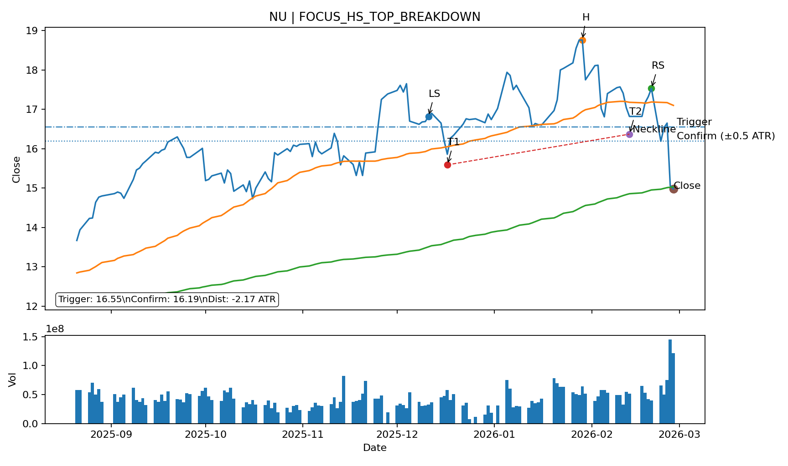
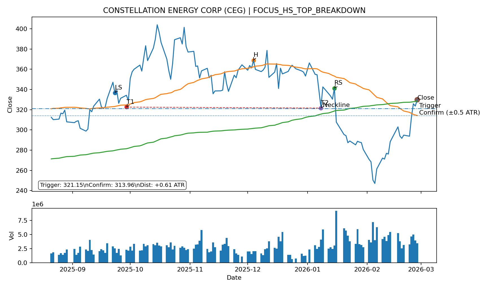

# Daily Report

_Generated: **2026-03-01 22:23 CET**_

## 1) Market recap & positioning

**Executive summary:**

Headline: Oil-supply fears tied to Iran headlines and Opec+ output moves kept markets on edge as investors weighed the risk of a sharper energy shock. The Nasdaq 100 fell 0.3% and the S&P 500 slid 0.4% while the Vix jumped 6.6%, extending a choppy, risk-sensitive tape of the past month (NDX -4.1% 1M), even as WTI rose 2.8% on expectations crude could open above $70. Biggest movers were Netflix up 13.8% and Silver up 7.2%, while Oklo fell 8.9% and QBTS dropped 6.8%.

**Key tape (multi-horizon):**

| Instrument       | Last      | 1D                                         | 7D                                          | 1M                                          | 3M                                          | 6M                                           |
| :--- | ---: | ---: | ---: | ---: | ---: | ---: |
| Nasdaq 100       | 24,960.04 | -0.30% | -0.21%  | -4.08%  | -1.87%  | +6.60%   |
| S&P 500          | 6,878.88  | -0.43% | -0.44%  | -1.42%  | +0.43%  | +6.48%   |
| STOXX Europe 600 | 633.85    | +0.11% | +0.52%  | +4.16%  | +9.96%  | +15.22%  |
| DAX              | 25,284.26 | -0.02% | +0.09%  | +1.86%  | +6.07%  | +5.78%   |
| CAC 40           | 8,580.75  | -0.47% | +0.77%  | +6.37%  | +5.64%  | +11.38%  |
| FTSE 100         | 10,910.60 | +0.59% | +2.09%  | +7.45%  | +12.24% | +18.76%  |
| VIX              | 19.86     | +6.60% | +4.03%  | +21.47% | +21.47% | +29.30%  |
| EUR/USD          | 1.18      | +0.24% | +0.53%  | -1.12%  | +1.98%  | +0.99%   |
| WTI Crude        | 67.02     | +2.78% | +0.95%  | +6.03%  | +14.47% | +4.70%   |
| Gold             | 5,247.90  | +1.38% | +3.73%  | -1.01%  | +24.41% | +51.08%  |
| Silver           | 93.29     | +7.23% | +13.38% | -17.52% | +65.27% | +132.07% |
| Coffee           | 284.90    | -0.38% | -1.18%  | -18.83% | -31.02% | -28.21%  |
| Cocoa            | 2,798.00  | -5.92% | -9.16%  | -32.58% | -48.22% | -63.35%  |
| Bitcoin          | 65,571.73 | -2.13% | -3.09%  | -22.06% | -24.04% | -41.03%  |

**Macro charts (5Y):**

<table><tr><td style='padding-right:12px;'></td><td></td></tr></table>

## 2) Biggest movers (≥ 4%)

**Session gainers:**

| Ticker   | pct     |
| :--- | ---: |
| NFLX     | +13.77% |
| Silver   | +7.23%  |
| NAT      | +6.11%  |
| INSW     | +4.16%  |

**Session losers:**

| Ticker   | pct    |
| :--- | ---: |
| OKLO     | -8.86% |
| QBTS     | -6.75% |
| IONQ     | -6.14% |
| Cocoa    | -5.92% |
| HOOD     | -4.53% |
| NVDA     | -4.16% |

**After-hours gainers:** _None ≥ 4%_

**After-hours losers:** _None ≥ 4%_

## 3) Earnings next 14 days (your watchlist)

_Upcoming earnings dates for your  watchlist._

| Ticker   | Earnings Date   |   Days |
| :--- | ---: | ---: |
| ANF      | 2026-03-04      |      3 |
| AVGO     | 2026-03-04      |      3 |
| MAU      | 2026-03-12      |     11 |
| RRTL     | 2026-03-12      |     11 |

## 4) Technical triggers

### Signal engine health (diagnostics)

- Tickers scanned: **1277**; usable OHLCV: **799**

- Candidates found: **172** (top patterns: MOMO_TREND:104, RECT:22, RECT_BOTTOM:16, RECT_TOP:16, DEAD_CAT_BOUNCE:11, DESC_TRIANGLE:2, HS_TOP:1)

- Live signals: EARLY **27**, CONFIRMED **47**, VALIDATED **1** (total 75)

- Geometry restored today: HS/IHS **265**, Band **7**

### Watchlist big movers diagnostics (|Day%| ≥ 7%)

<table class="tblauto"><thead><tr><th>Name of Company</th><th>Ticker</th><th>Close</th><th>Day%</th><th>BestPattern</th><th>Dir</th><th>Dist(ATR)</th><th>PriceGate</th><th>CLVGate</th><th>VolGate</th><th>HS lag</th><th>Cand#</th></tr></thead><tbody><tr><td class="wrap">NFLX</td><td class="txt">NFLX</td><td class="num">96.24</td><td class="num">+13.8%</td><td class="txt"></td><td class="txt"></td><td class="num"></td><td class="txt">N</td><td class="txt">N</td><td class="txt">N</td><td class="txt"></td><td class="txt">0</td></tr><tr><td class="wrap">NU</td><td class="txt">NU</td><td class="num">14.98</td><td class="num">-0.5%</td><td class="txt">HS_TOP</td><td class="txt">BREAKDOWN</td><td class="num">-2.17</td><td class="txt">Y</td><td class="txt">N</td><td class="txt">Y</td><td class="txt">5</td><td class="txt">1</td></tr><tr><td class="wrap">OKLO INC CLASS A</td><td class="txt">OKLO</td><td class="num">62.95</td><td class="num">-8.9%</td><td class="txt"></td><td class="txt"></td><td class="num"></td><td class="txt">N</td><td class="txt">N</td><td class="txt">N</td><td class="txt"></td><td class="txt">0</td></tr><tr><td class="wrap">CONSTELLATION ENERGY CORP</td><td class="txt">CEG</td><td class="num">329.88</td><td class="num">+2.0%</td><td class="txt">HS_TOP</td><td class="txt">BREAKDOWN</td><td class="num">+0.61</td><td class="txt">N</td><td class="txt">N</td><td class="txt">N</td><td class="txt">29</td><td class="txt">1</td></tr></tbody></table>

### Focus tickers deep-dive (always shown)

**NU HOLDINGS LTD. (NU)**

- HS/IHS detected today: **YES**

- HS_TOP reject summary: head_not_global:786, ls_not_max_prehead:30, no_triplet:1

- IHS reject summary: head_not_global:665, time_symmetry:15, no_triplet:1

- NU swing-high check (Close-based) @ 2026-01-05: ok=True | reason=None

  - hit=2026-01-05 00:00:00 (i=93) | Close=17.94 | cwin_max=17.94 (count=1) | prom=1.29 vs thr=0.20 (ATR=0.39)

- NU swing-high check (High-based) @ 2026-01-05: ok=False | reason=not_local_max_in_window

  - hit=2026-01-05 00:00:00 (i=152) | High=18.14 | hwin_max=18.37 (count=1) | prom=1.49 vs thr=0.20 (ATR=0.39)

- Best candidate: **HS_TOP / BREAKDOWN** | Dist(ATR) **-2.17** | Gates: Price **Y**, CLV **N**, Vol **Y** | HS lag **5**

  - Gate inputs: CLV=0.11999893188476562 | VolRatio=2.1237622474130693

  - LS/H/RS geometry (idx): LS=78, H=110, RS=125

  - LS/H/RS geometry (ts): LS=2025-12-11T00:00:00, H=2026-01-29T00:00:00, RS=2026-02-20T00:00:00

  - Pre-head maxClose (swing pivot) between (LS,H): 18.76 at 2026-01-28 00:00:00 | LS_Close=16.82

  - Post-head maxClose (swing pivot) between (H,RS): 17.57 at 2026-02-10 00:00:00 | RS_Close=17.53

**CONSTELLATION ENERGY CORP (CEG)**

- HS/IHS detected today: **YES**

- HS_TOP reject summary: head_not_global:1231, duration_or_sidebars:99, no_triplet:1

- IHS reject summary: head_not_global:816, no_triplet:1

- Best candidate: **HS_TOP / BREAKDOWN** | Dist(ATR) **+0.61** | Gates: Price **N**, CLV **N**, Vol **N** | HS lag **29**

  - Gate inputs: CLV=0.9540953619556655 | VolRatio=0.8032524619589796

  - LS/H/RS geometry (idx): LS=22, H=73, RS=101

  - LS/H/RS geometry (ts): LS=2025-09-23T00:00:00, H=2025-12-04T00:00:00, RS=2026-01-15T00:00:00

  - Pre-head maxClose (swing pivot) between (LS,H): 403.95 at 2025-10-15 00:00:00 | LS_Close=336.65

  - Post-head maxClose (swing pivot) between (H,RS): 378.60 at 2025-12-11 00:00:00 | RS_Close=341.20

### 4A) Watchlist emerging chart trends

_Logic: score each ticker by stage (EARLY=1, CONFIRMED=3, VALIDATED=4) × direction (BREAKOUT=+1, BREAKDOWN=-1), then aggregate by sector._

| Sector | Bias | EARLY↑ | EARLY↓ | CONF↑ | CONF↓ | VALID↑ | VALID↓ |
| :--- | :--- | ---: | ---: | ---: | ---: | ---: | ---: |
| AI compute & semis (incl. EDA) | Mixed | 0 | 0 | 0 | 0 | 0 | 0 |
| AI software/data | Mixed | 0 | 0 | 0 | 0 | 0 | 0 |
| Big Tech platforms | Mixed | 0 | 0 | 0 | 0 | 0 | 0 |
| Consumer & retail (incl. luxury) | Mixed | 0 | 0 | 0 | 0 | 0 | 0 |
| Fintech & financials | Bearish | 0 | 0 | 0 | 1 | 0 | 0 |
| Healthcare | Mixed | 0 | 0 | 0 | 0 | 0 | 0 |
| Energy & Nuclear | Mixed | 1 | 1 | 0 | 0 | 0 | 0 |
| Quantum | Mixed | 0 | 0 | 0 | 0 | 0 | 0 |
| Venezuela Oil | Bullish | 0 | 0 | 4 | 0 | 0 | 0 |
| Commodities | Mixed | 0 | 0 | 0 | 0 | 0 | 0 |

### 4B) Early callouts (~90% complete)

_Close enough to pre-plan. “Close enough” = within 0.5 ATR of the trigger (neckline/boundary). No SOFT tier — anything not CONFIRMED stays in EARLY._

**NEW (today):**

<em>None</em>

**ONGOING:**

<table class="tblauto"><thead><tr><th>Name of Company</th><th>Ticker</th><th>Country</th><th>Sector</th><th>Signal</th><th>Close</th><th>Day%</th><th>Threshold</th><th>CLV</th><th>ATR(14)</th><th>Dist(ATR)</th><th>Vol/AvgVol(20)</th><th>Chart</th></tr></thead><tbody><tr><td class="wrap">VISTRA CORP</td><td class="txt">VST</td><td class="txt">United States</td><td class="txt">Utilities</td><td class="txt">EARLY_RECT_BOTTOM_BREAKOUT</td><td class="num">173.89</td><td class="num">-1.7%</td><td class="num">173.32</td><td class="num">-0.19</td><td class="num">7.33</td><td class="num">+0.08</td><td class="num">0.96×</td><td class="txt"><a href="img/VST_EARLY_RECT_BOTTOM_BREAKOUT.png">chart</a></td></tr><tr><td class="wrap">RESMED INC</td><td class="txt">RMD</td><td class="txt">United States</td><td class="txt">Health Care</td><td class="txt">EARLY_IHS_BREAKOUT</td><td class="num">256.26</td><td class="num">-0.3%</td><td class="num">256.87</td><td class="num">+0.48</td><td class="num">7.69</td><td class="num">-0.08</td><td class="num">0.82×</td><td class="txt"><a href="img/RMD_EARLY_IHS_BREAKOUT.png">chart</a></td></tr><tr><td class="wrap">SMR</td><td class="txt">SMR</td><td class="txt">United States</td><td class="txt">Utilities</td><td class="txt">EARLY_RECT_BOTTOM_BREAKDOWN</td><td class="num">12.85</td><td class="num">-3.6%</td><td class="num">12.95</td><td class="num">-0.56</td><td class="num">1.23</td><td class="num">-0.08</td><td class="num">0.98×</td><td class="txt"><a href="img/SMR_EARLY_RECT_BOTTOM_BREAKDOWN.png">chart</a></td></tr><tr><td class="wrap">ALLSTATE CORP</td><td class="txt">ALL</td><td class="txt">United States</td><td class="txt">Financials</td><td class="txt">EARLY_RECT_BREAKOUT</td><td class="num">214.52</td><td class="num">+0.8%</td><td class="num">214.98</td><td class="num">+0.57</td><td class="num">5.51</td><td class="num">-0.08</td><td class="num">1.28×</td><td class="txt"><a href="img/ALL_EARLY_RECT_BREAKOUT.png">chart</a></td></tr><tr><td class="wrap">ROCKET LAB CORP</td><td class="txt">RKLB</td><td class="txt">United States</td><td class="txt">Industrials</td><td class="txt">EARLY_HS_TOP_BREAKDOWN</td><td class="num">69.10</td><td class="num">-4.9%</td><td class="num">68.65</td><td class="num">+0.82</td><td class="num">5.27</td><td class="num">+0.08</td><td class="num">1.48×</td><td class="txt"><a href="img/RKLB_EARLY_HS_TOP_BREAKDOWN.png">chart</a></td></tr><tr><td class="wrap">ELEVANCE HEALTH INC</td><td class="txt">ELV</td><td class="txt">United States</td><td class="txt">Health Care</td><td class="txt">EARLY_HS_TOP_BREAKDOWN</td><td class="num">320.00</td><td class="num">-0.9%</td><td class="num">321.26</td><td class="num">+0.38</td><td class="num">11.15</td><td class="num">-0.11</td><td class="num">2.76×</td><td class="txt"><a href="img/ELV_EARLY_HS_TOP_BREAKDOWN.png">chart</a></td></tr><tr><td class="wrap">ORIENTAL LAND LTD</td><td class="txt">4661</td><td class="txt">Japan</td><td class="txt">Consumer Discretionary</td><td class="txt">EARLY_IHS_BREAKOUT</td><td class="num">2,816.00</td><td class="num">-0.1%</td><td class="num">2,808.28</td><td class="num">-1.00</td><td class="num">58.11</td><td class="num">+0.13</td><td class="num">1.78×</td><td class="txt"><a href="img/4661.T_EARLY_IHS_BREAKOUT.png">chart</a></td></tr><tr><td class="wrap">SHIMADZU CORP</td><td class="txt">7701</td><td class="txt">Japan</td><td class="txt">Information Technology</td><td class="txt">EARLY_RECT_TOP_BREAKOUT</td><td class="num">4,359.00</td><td class="num">+0.2%</td><td class="num">4,345.22</td><td class="num">+0.23</td><td class="num">98.21</td><td class="num">+0.14</td><td class="num">2.77×</td><td class="txt"><a href="img/7701.T_EARLY_RECT_TOP_BREAKOUT.png">chart</a></td></tr><tr><td class="wrap">HORMEL FOODS CORP</td><td class="txt">HRL</td><td class="txt">United States</td><td class="txt">Consumer Staples</td><td class="txt">EARLY_IHS_BREAKOUT</td><td class="num">25.60</td><td class="num">+3.1%</td><td class="num">25.48</td><td class="num">+0.50</td><td class="num">0.75</td><td class="num">+0.16</td><td class="num">1.16×</td><td class="txt"><a href="img/HRL_EARLY_IHS_BREAKOUT.png">chart</a></td></tr><tr><td class="wrap">NIPPON STEEL CORP</td><td class="txt">5401</td><td class="txt">Japan</td><td class="txt">Materials</td><td class="txt">EARLY_HS_TOP_BREAKDOWN</td><td class="num">636.00</td><td class="num">+1.6%</td><td class="num">639.88</td><td class="num">+0.52</td><td class="num">24.09</td><td class="num">-0.16</td><td class="num">1.66×</td><td class="txt"><a href="img/5401.T_EARLY_HS_TOP_BREAKDOWN.png">chart</a></td></tr><tr><td class="wrap">MASCO CORP</td><td class="txt">MAS</td><td class="txt">United States</td><td class="txt">Industrials</td><td class="txt">EARLY_IHS_BREAKOUT</td><td class="num">71.62</td><td class="num">-1.1%</td><td class="num">72.08</td><td class="num">+0.08</td><td class="num">2.56</td><td class="num">-0.18</td><td class="num">0.72×</td><td class="txt"><a href="img/MAS_EARLY_IHS_BREAKOUT.png">chart</a></td></tr><tr><td class="wrap">ESSENTIAL UTILITIES INC</td><td class="txt">WTRG</td><td class="txt">United States</td><td class="txt">Utilities</td><td class="txt">EARLY_RECT_BOTTOM_BREAKOUT</td><td class="num">39.97</td><td class="num">+0.5%</td><td class="num">40.20</td><td class="num">-0.57</td><td class="num">1.04</td><td class="num">-0.22</td><td class="num">12.98×</td><td class="txt"><a href="img/WTRG_EARLY_RECT_BOTTOM_BREAKOUT.png">chart</a></td></tr><tr><td class="wrap">GENERAL MOTORS</td><td class="txt">GM</td><td class="txt">United States</td><td class="txt">Consumer Discretionary</td><td class="txt">EARLY_RECT_TOP_BREAKDOWN</td><td class="num">78.71</td><td class="num">-2.6%</td><td class="num">79.29</td><td class="num">-0.22</td><td class="num">2.50</td><td class="num">-0.23</td><td class="num">1.70×</td><td class="txt"><a href="img/GM_EARLY_RECT_TOP_BREAKDOWN.png">chart</a></td></tr><tr><td class="wrap">KOBE BUSSAN LTD</td><td class="txt">3038</td><td class="txt">Japan</td><td class="txt">Consumer Staples</td><td class="txt">EARLY_RECT_BREAKDOWN</td><td class="num">3,706.00</td><td class="num">-0.1%</td><td class="num">3,686.00</td><td class="num">+0.59</td><td class="num">83.64</td><td class="num">+0.24</td><td class="num">7.69×</td><td class="txt"><a href="img/3038.T_EARLY_RECT_BREAKDOWN.png">chart</a></td></tr><tr><td class="wrap">JAPAN AIRLINES LTD</td><td class="txt">9201</td><td class="txt">Japan</td><td class="txt">Industrials</td><td class="txt">EARLY_IHS_BREAKOUT</td><td class="num">3,228.00</td><td class="num">+0.4%</td><td class="num">3,242.94</td><td class="num">-0.63</td><td class="num">61.71</td><td class="num">-0.24</td><td class="num">1.14×</td><td class="txt"><a href="img/9201.T_EARLY_IHS_BREAKOUT.png">chart</a></td></tr><tr><td class="wrap">MONGODB INC CLASS A</td><td class="txt">MDB</td><td class="txt">United States</td><td class="txt">Information Technology</td><td class="txt">EARLY_HS_TOP_BREAKDOWN</td><td class="num">328.47</td><td class="num">-2.4%</td><td class="num">321.85</td><td class="num">+0.53</td><td class="num">24.63</td><td class="num">+0.27</td><td class="num">1.00×</td><td class="txt"><a href="img/MDB_EARLY_HS_TOP_BREAKDOWN.png">chart</a></td></tr><tr><td class="wrap">CRH PUBLIC LIMITED PLC</td><td class="txt">CRH</td><td class="txt">United States</td><td class="txt">Materials</td><td class="txt">EARLY_RECT_TOP_BREAKDOWN</td><td class="num">119.98</td><td class="num">-1.0%</td><td class="num">118.92</td><td class="num">+0.76</td><td class="num">3.92</td><td class="num">+0.27</td><td class="num">1.50×</td><td class="txt"><a href="img/CRH_EARLY_RECT_TOP_BREAKDOWN.png">chart</a></td></tr><tr><td class="wrap">MARVELL TECHNOLOGY INC</td><td class="txt">MRVL</td><td class="txt">United States</td><td class="txt">Information Technology</td><td class="txt">EARLY_HS_TOP_BREAKDOWN</td><td class="num">81.69</td><td class="num">+3.0%</td><td class="num">82.86</td><td class="num">+0.67</td><td class="num">3.21</td><td class="num">-0.36</td><td class="num">1.57×</td><td class="txt"><a href="img/MRVL_EARLY_HS_TOP_BREAKDOWN.png">chart</a></td></tr><tr><td class="wrap">COSTCO WHOLESALE CORP</td><td class="txt">COST</td><td class="txt">United States</td><td class="txt">Consumer Staples</td><td class="txt">EARLY_IHS_BREAKOUT</td><td class="num">1,010.79</td><td class="num">+2.4%</td><td class="num">1,002.67</td><td class="num">+0.72</td><td class="num">20.71</td><td class="num">+0.39</td><td class="num">1.86×</td><td class="txt"><a href="img/COST_EARLY_IHS_BREAKOUT.png">chart</a></td></tr><tr><td class="wrap">DICKS SPORTING INC</td><td class="txt">DKS</td><td class="txt">United States</td><td class="txt">Consumer Discretionary</td><td class="txt">EARLY_IHS_BREAKOUT</td><td class="num">203.63</td><td class="num">-3.7%</td><td class="num">200.68</td><td class="num">-0.88</td><td class="num">7.39</td><td class="num">+0.40</td><td class="num">1.10×</td><td class="txt"><a href="img/DKS_EARLY_IHS_BREAKOUT.png">chart</a></td></tr><tr><td class="wrap">NIPPON YUSEN</td><td class="txt">9101</td><td class="txt">Japan</td><td class="txt">Industrials</td><td class="txt">EARLY_IHS_BREAKOUT</td><td class="num">5,369.00</td><td class="num">-0.2%</td><td class="num">5,401.94</td><td class="num">-0.20</td><td class="num">80.64</td><td class="num">-0.41</td><td class="num">1.66×</td><td class="txt"><a href="img/9101.T_EARLY_IHS_BREAKOUT.png">chart</a></td></tr><tr><td class="wrap">DANONE SA</td><td class="txt">BN</td><td class="txt">France</td><td class="txt">Consumer Staples</td><td class="txt">EARLY_RECT_BREAKDOWN</td><td class="num">43.84</td><td class="num">-3.5%</td><td class="num">44.46</td><td class="num">-0.17</td><td class="num">1.47</td><td class="num">-0.42</td><td class="num">1.85×</td><td class="txt"><a href="img/BN_EARLY_RECT_BREAKDOWN.png">chart</a></td></tr><tr><td class="wrap">HYATT HOTELS CORP CLASS A</td><td class="txt">H</td><td class="txt">United States</td><td class="txt">Consumer Discretionary</td><td class="txt">EARLY_RECT_BREAKDOWN</td><td class="num">161.50</td><td class="num">-5.7%</td><td class="num">158.30</td><td class="num">-0.85</td><td class="num">7.39</td><td class="num">+0.43</td><td class="num">1.82×</td><td class="txt"><a href="img/H_EARLY_RECT_BREAKDOWN.png">chart</a></td></tr><tr><td class="wrap">AMERICAN WATER WORKS INC</td><td class="txt">AWK</td><td class="txt">United States</td><td class="txt">Utilities</td><td class="txt">EARLY_RECT_BOTTOM_BREAKOUT</td><td class="num">136.03</td><td class="num">+1.3%</td><td class="num">134.41</td><td class="num">-0.04</td><td class="num">3.70</td><td class="num">+0.44</td><td class="num">1.30×</td><td class="txt"><a href="img/AWK_EARLY_RECT_BOTTOM_BREAKOUT.png">chart</a></td></tr><tr><td class="wrap">FASTENAL</td><td class="txt">FAST</td><td class="txt">United States</td><td class="txt">Industrials</td><td class="txt">EARLY_IHS_BREAKOUT</td><td class="num">46.04</td><td class="num">+0.8%</td><td class="num">45.53</td><td class="num">+0.41</td><td class="num">1.16</td><td class="num">+0.44</td><td class="num">1.13×</td><td class="txt"><a href="img/FAST_EARLY_IHS_BREAKOUT.png">chart</a></td></tr><tr><td class="wrap">GALAXY ENTERTAINMENT GROUP LTD</td><td class="txt">0027</td><td class="txt">Hong Kong</td><td class="txt">Consumer Discretionary</td><td class="txt">EARLY_IHS_BREAKOUT</td><td class="num">41.76</td><td class="num">+0.8%</td><td class="num">42.28</td><td class="num">+1.00</td><td class="num">1.13</td><td class="num">-0.46</td><td class="num">1.56×</td><td class="txt"><a href="img/0027.HK_EARLY_IHS_BREAKOUT.png">chart</a></td></tr><tr><td class="wrap">ZOETIS INC CLASS A</td><td class="txt">ZTS</td><td class="txt">United States</td><td class="txt">Health Care</td><td class="txt">EARLY_IHS_BREAKOUT</td><td class="num">131.10</td><td class="num">+1.0%</td><td class="num">133.07</td><td class="num">+0.41</td><td class="num">4.23</td><td class="num">-0.47</td><td class="num">1.18×</td><td class="txt"><a href="img/ZTS_EARLY_IHS_BREAKOUT.png">chart</a></td></tr></tbody></table>

### 4C) Confirmed breakouts / breakdowns (watchlist + MSCI World)

_Includes **CONFIRMED** only: close beyond trigger by ≥0.5 ATR AND Volume ≥1.25×AvgVol(20) AND CLV ≥+0.70 (breakout) / ≤−0.70 (breakdown). All tickers use S&P 500 11-sector labels (Sector)._ 

**NEW (today):**

<table class="tblauto"><thead><tr><th>Name of Company</th><th>Ticker</th><th>Country</th><th>Sector</th><th>Signal</th><th>Close</th><th>Day%</th><th>Threshold</th><th>CLV</th><th>ATR(14)</th><th>Dist(ATR)</th><th>Vol/AvgVol(20)</th><th>HVN Runway%</th><th>Chart</th></tr></thead><tbody><tr><td class="wrap">ISUZU MOTORS LTD</td><td class="txt">7202</td><td class="txt">Japan</td><td class="txt">Consumer Discretionary</td><td class="txt">CONFIRMED_MOMO_TREND_BREAKOUT</td><td class="num">2,918.50</td><td class="num">+2.1%</td><td class="num">2,760.58</td><td class="num">+0.96</td><td class="num">98.07</td><td class="num">+1.61</td><td class="num">1.41×</td><td class="num"></td><td class="txt"><a href="img/7202.T_CONFIRMED_MOMO_TREND_BREAKOUT.png">chart</a></td></tr><tr><td class="wrap">ROSS STORES INC</td><td class="txt">ROST</td><td class="txt">United States</td><td class="txt">Consumer Discretionary</td><td class="txt">CONFIRMED_MOMO_TREND_BREAKOUT</td><td class="num">205.64</td><td class="num">+1.1%</td><td class="num">197.41</td><td class="num">+0.70</td><td class="num">3.82</td><td class="num">+2.16</td><td class="num">1.92×</td><td class="num">-15.85%</td><td class="txt"><a href="img/ROST_CONFIRMED_MOMO_TREND_BREAKOUT.png">chart</a></td></tr><tr><td class="wrap">PROCTER & GAMBLE</td><td class="txt">PG</td><td class="txt">United States</td><td class="txt">Consumer Staples</td><td class="txt">CONFIRMED_IHS_BREAKOUT</td><td class="num">167.20</td><td class="num">+2.1%</td><td class="num">151.74</td><td class="num">+0.97</td><td class="num">3.25</td><td class="num">+4.76</td><td class="num">1.29×</td><td class="num"></td><td class="txt"></td></tr><tr><td class="wrap">PROCTER & GAMBLE</td><td class="txt">PG</td><td class="txt">United States</td><td class="txt">Consumer Staples</td><td class="txt">CONFIRMED_MOMO_TREND_BREAKOUT</td><td class="num">167.20</td><td class="num">+2.1%</td><td class="num">159.47</td><td class="num">+0.97</td><td class="num">3.25</td><td class="num">+2.38</td><td class="num">1.29×</td><td class="num"></td><td class="txt"><a href="img/PG_CONFIRMED_MOMO_TREND_BREAKOUT.png">chart</a></td></tr><tr><td class="wrap">IDEMITSU KOSAN LTD</td><td class="txt">5019</td><td class="txt">Japan</td><td class="txt">Energy</td><td class="txt">CONFIRMED_MOMO_TREND_BREAKOUT</td><td class="num">1,491.00</td><td class="num">+6.2%</td><td class="num">1,384.57</td><td class="num">+0.89</td><td class="num">41.61</td><td class="num">+2.56</td><td class="num">1.63×</td><td class="num"></td><td class="txt"><a href="img/5019.T_CONFIRMED_MOMO_TREND_BREAKOUT.png">chart</a></td></tr><tr><td class="wrap">AMERICAN EXPRESS</td><td class="txt">AXP</td><td class="txt">United States</td><td class="txt">Financials</td><td class="txt">CONFIRMED_HS_TOP_BREAKDOWN</td><td class="num">308.90</td><td class="num">-7.9%</td><td class="num">363.84</td><td class="num">-0.82</td><td class="num">12.14</td><td class="num">-4.53</td><td class="num">2.60×</td><td class="num"></td><td class="txt"></td></tr><tr><td class="wrap">BOC HONG KONG HOLDINGS LTD</td><td class="txt">2388</td><td class="txt">Hong Kong</td><td class="txt">Financials</td><td class="txt">CONFIRMED_MOMO_TREND_BREAKOUT</td><td class="num">44.90</td><td class="num">+2.3%</td><td class="num">42.81</td><td class="num">+1.00</td><td class="num">0.84</td><td class="num">+2.50</td><td class="num">1.33×</td><td class="num"></td><td class="txt"><a href="img/2388.HK_CONFIRMED_MOMO_TREND_BREAKOUT.png">chart</a></td></tr><tr><td class="wrap">JAPAN EXCHANGE GROUP INC</td><td class="txt">8697</td><td class="txt">Japan</td><td class="txt">Financials</td><td class="txt">CONFIRMED_MOMO_TREND_BREAKOUT</td><td class="num">2,135.50</td><td class="num">+3.5%</td><td class="num">1,871.81</td><td class="num">+0.88</td><td class="num">68.96</td><td class="num">+3.82</td><td class="num">1.50×</td><td class="num"></td><td class="txt"></td></tr><tr><td class="wrap">JAPAN EXCHANGE GROUP INC</td><td class="txt">8697</td><td class="txt">Japan</td><td class="txt">Financials</td><td class="txt">CONFIRMED_RECT_TOP_BREAKOUT</td><td class="num">2,135.50</td><td class="num">+3.5%</td><td class="num">1,862.97</td><td class="num">+0.88</td><td class="num">68.96</td><td class="num">+3.95</td><td class="num">1.50×</td><td class="num"></td><td class="txt"></td></tr><tr><td class="wrap">JOHNSON & JOHNSON</td><td class="txt">JNJ</td><td class="txt">United States</td><td class="txt">Health Care</td><td class="txt">CONFIRMED_MOMO_TREND_BREAKOUT</td><td class="num">248.43</td><td class="num">+2.0%</td><td class="num">239.75</td><td class="num">+0.84</td><td class="num">3.85</td><td class="num">+2.26</td><td class="num">1.77×</td><td class="num"></td><td class="txt"><a href="img/JNJ_CONFIRMED_MOMO_TREND_BREAKOUT.png">chart</a></td></tr><tr><td class="wrap">LENNOX INTERNATIONAL INC</td><td class="txt">LII</td><td class="txt">United States</td><td class="txt">Industrials</td><td class="txt">CONFIRMED_IHS_BREAKOUT</td><td class="num">569.94</td><td class="num">+4.7%</td><td class="num">523.29</td><td class="num">+0.76</td><td class="num">18.97</td><td class="num">+2.46</td><td class="num">1.80×</td><td class="num">-16.14%</td><td class="txt"><a href="img/LII_CONFIRMED_IHS_BREAKOUT.png">chart</a></td></tr><tr><td class="wrap">GRACO INC</td><td class="txt">GGG</td><td class="txt">United States</td><td class="txt">Industrials</td><td class="txt">CONFIRMED_IHS_BREAKOUT</td><td class="num">93.92</td><td class="num">+1.0%</td><td class="num">89.74</td><td class="num">+0.98</td><td class="num">1.65</td><td class="num">+2.53</td><td class="num">1.48×</td><td class="num">-2.01%</td><td class="txt"><a href="img/GGG_CONFIRMED_IHS_BREAKOUT.png">chart</a></td></tr><tr><td class="wrap">GEA GROUP AG</td><td class="txt">G1A</td><td class="txt">Germany</td><td class="txt">Industrials</td><td class="txt">CONFIRMED_IHS_BREAKOUT</td><td class="num">65.90</td><td class="num">+1.2%</td><td class="num">62.67</td><td class="num">+1.00</td><td class="num">1.06</td><td class="num">+3.06</td><td class="num">3.98×</td><td class="num">-14.05%</td><td class="txt"></td></tr><tr><td class="wrap">HANKYU HANSHIN HOLDINGS INC</td><td class="txt">9042</td><td class="txt">Japan</td><td class="txt">Industrials</td><td class="txt">CONFIRMED_IHS_BREAKOUT</td><td class="num">4,555.00</td><td class="num">+1.2%</td><td class="num">4,240.82</td><td class="num">+1.00</td><td class="num">97.29</td><td class="num">+3.23</td><td class="num">1.28×</td><td class="num">-16.22%</td><td class="txt"></td></tr><tr><td class="wrap">SEKISUI CHEMICAL LTD</td><td class="txt">4204</td><td class="txt">Japan</td><td class="txt">Industrials</td><td class="txt">CONFIRMED_IHS_BREAKOUT</td><td class="num">3,049.00</td><td class="num">+1.8%</td><td class="num">2,815.62</td><td class="num">+0.86</td><td class="num">58.96</td><td class="num">+3.96</td><td class="num">1.55×</td><td class="num">-17.42%</td><td class="txt"></td></tr><tr><td class="wrap">JB HUNT TRANSPORT SERVICES INC</td><td class="txt">JBHT</td><td class="txt">United States</td><td class="txt">Industrials</td><td class="txt">CONFIRMED_MOMO_TREND_BREAKOUT</td><td class="num">233.41</td><td class="num">+2.3%</td><td class="num">222.11</td><td class="num">+0.89</td><td class="num">8.16</td><td class="num">+1.39</td><td class="num">1.28×</td><td class="num"></td><td class="txt"><a href="img/JBHT_CONFIRMED_MOMO_TREND_BREAKOUT.png">chart</a></td></tr><tr><td class="wrap">CSX CORP</td><td class="txt">CSX</td><td class="txt">United States</td><td class="txt">Industrials</td><td class="txt">CONFIRMED_MOMO_TREND_BREAKOUT</td><td class="num">42.69</td><td class="num">+0.1%</td><td class="num">40.90</td><td class="num">+0.77</td><td class="num">0.83</td><td class="num">+2.14</td><td class="num">1.37×</td><td class="num"></td><td class="txt"><a href="img/CSX_CONFIRMED_MOMO_TREND_BREAKOUT.png">chart</a></td></tr><tr><td class="wrap">DAI NIPPON PRINTING LTD</td><td class="txt">7912</td><td class="txt">Japan</td><td class="txt">Industrials</td><td class="txt">CONFIRMED_MOMO_TREND_BREAKOUT</td><td class="num">3,250.00</td><td class="num">+2.0%</td><td class="num">3,049.84</td><td class="num">+1.00</td><td class="num">86.11</td><td class="num">+2.32</td><td class="num">1.25×</td><td class="num"></td><td class="txt"><a href="img/7912.T_CONFIRMED_MOMO_TREND_BREAKOUT.png">chart</a></td></tr><tr><td class="wrap">JARDINE MATHESON HOLDINGS LTD</td><td class="txt">J36</td><td class="txt">Hong Kong</td><td class="txt">Industrials</td><td class="txt">CONFIRMED_MOMO_TREND_BREAKOUT</td><td class="num">82.50</td><td class="num">+2.5%</td><td class="num">77.76</td><td class="num">+1.00</td><td class="num">2.02</td><td class="num">+2.35</td><td class="num">1.57×</td><td class="num"></td><td class="txt"><a href="img/J36.SI_CONFIRMED_MOMO_TREND_BREAKOUT.png">chart</a></td></tr><tr><td class="wrap">OBAYASHI CORP</td><td class="txt">1802</td><td class="txt">Japan</td><td class="txt">Industrials</td><td class="txt">CONFIRMED_MOMO_TREND_BREAKOUT</td><td class="num">4,416.00</td><td class="num">+4.4%</td><td class="num">4,037.94</td><td class="num">+0.79</td><td class="num">155.29</td><td class="num">+2.43</td><td class="num">1.36×</td><td class="num"></td><td class="txt"><a href="img/1802.T_CONFIRMED_MOMO_TREND_BREAKOUT.png">chart</a></td></tr><tr><td class="wrap">TOPPAN HOLDINGS INC</td><td class="txt">7911</td><td class="txt">Japan</td><td class="txt">Industrials</td><td class="txt">CONFIRMED_MOMO_TREND_BREAKOUT</td><td class="num">5,365.00</td><td class="num">+4.3%</td><td class="num">4,856.67</td><td class="num">+1.00</td><td class="num">196.00</td><td class="num">+2.59</td><td class="num">1.63×</td><td class="num"></td><td class="txt"><a href="img/7911.T_CONFIRMED_MOMO_TREND_BREAKOUT.png">chart</a></td></tr><tr><td class="wrap">SITC INTERNATIONAL HOLDINGS LTD</td><td class="txt">1308</td><td class="txt">Hong Kong</td><td class="txt">Industrials</td><td class="txt">CONFIRMED_MOMO_TREND_BREAKOUT</td><td class="num">33.38</td><td class="num">+3.1%</td><td class="num">30.93</td><td class="num">+1.00</td><td class="num">0.94</td><td class="num">+2.61</td><td class="num">2.18×</td><td class="num"></td><td class="txt"><a href="img/1308.HK_CONFIRMED_MOMO_TREND_BREAKOUT.png">chart</a></td></tr><tr><td class="wrap">TOKYU CORP</td><td class="txt">9005</td><td class="txt">Japan</td><td class="txt">Industrials</td><td class="txt">CONFIRMED_MOMO_TREND_BREAKOUT</td><td class="num">1,997.50</td><td class="num">+1.4%</td><td class="num">1,907.51</td><td class="num">+0.93</td><td class="num">34.07</td><td class="num">+2.64</td><td class="num">1.52×</td><td class="num">-15.74%</td><td class="txt"><a href="img/9005.T_CONFIRMED_MOMO_TREND_BREAKOUT.png">chart</a></td></tr><tr><td class="wrap">TAISEI CORP</td><td class="txt">1801</td><td class="txt">Japan</td><td class="txt">Industrials</td><td class="txt">CONFIRMED_MOMO_TREND_BREAKOUT</td><td class="num">20,340.00</td><td class="num">+6.3%</td><td class="num">18,007.84</td><td class="num">+0.89</td><td class="num">765.00</td><td class="num">+3.05</td><td class="num">1.71×</td><td class="num"></td><td class="txt"><a href="img/1801.T_CONFIRMED_MOMO_TREND_BREAKOUT.png">chart</a></td></tr><tr><td class="wrap">KAWASAKI KISEN LTD</td><td class="txt">9107</td><td class="txt">Japan</td><td class="txt">Industrials</td><td class="txt">CONFIRMED_MOMO_TREND_BREAKOUT</td><td class="num">2,513.00</td><td class="num">+0.4%</td><td class="num">2,359.96</td><td class="num">+1.00</td><td class="num">45.57</td><td class="num">+3.36</td><td class="num">1.24×</td><td class="num"></td><td class="txt"></td></tr><tr><td class="wrap">AGC INC</td><td class="txt">5201</td><td class="txt">Japan</td><td class="txt">Industrials</td><td class="txt">CONFIRMED_MOMO_TREND_BREAKOUT</td><td class="num">6,930.00</td><td class="num">+4.2%</td><td class="num">6,274.21</td><td class="num">+0.78</td><td class="num">166.57</td><td class="num">+3.94</td><td class="num">2.07×</td><td class="num"></td><td class="txt"></td></tr><tr><td class="wrap">FRO</td><td class="txt">FRO</td><td class="txt">United States</td><td class="txt">Industrials</td><td class="txt">CONFIRMED_MOMO_TREND_BREAKOUT</td><td class="num">37.95</td><td class="num">+1.8%</td><td class="num">32.59</td><td class="num">+0.98</td><td class="num">1.26</td><td class="num">+4.24</td><td class="num">2.16×</td><td class="num"></td><td class="txt"></td></tr><tr><td class="wrap">TOPPAN HOLDINGS INC</td><td class="txt">7911</td><td class="txt">Japan</td><td class="txt">Industrials</td><td class="txt">CONFIRMED_RECT_TOP_BREAKOUT</td><td class="num">5,365.00</td><td class="num">+4.3%</td><td class="num">4,866.26</td><td class="num">+1.00</td><td class="num">196.00</td><td class="num">+2.54</td><td class="num">1.63×</td><td class="num"></td><td class="txt"><a href="img/7911.T_CONFIRMED_RECT_TOP_BREAKOUT.png">chart</a></td></tr><tr><td class="wrap">ECOLAB INC</td><td class="txt">ECL</td><td class="txt">United States</td><td class="txt">Materials</td><td class="txt">CONFIRMED_IHS_BREAKOUT</td><td class="num">308.35</td><td class="num">+0.5%</td><td class="num">267.16</td><td class="num">+1.00</td><td class="num">6.29</td><td class="num">+6.55</td><td class="num">1.34×</td><td class="num"></td><td class="txt"></td></tr><tr><td class="wrap">ECOLAB INC</td><td class="txt">ECL</td><td class="txt">United States</td><td class="txt">Materials</td><td class="txt">CONFIRMED_MOMO_TREND_BREAKOUT</td><td class="num">308.35</td><td class="num">+0.5%</td><td class="num">298.43</td><td class="num">+1.00</td><td class="num">6.29</td><td class="num">+1.58</td><td class="num">1.34×</td><td class="num"></td><td class="txt"><a href="img/ECL_CONFIRMED_MOMO_TREND_BREAKOUT.png">chart</a></td></tr><tr><td class="wrap">MITSUBISHI CHEMICAL GROUP CORP</td><td class="txt">4188</td><td class="txt">Japan</td><td class="txt">Materials</td><td class="txt">CONFIRMED_MOMO_TREND_BREAKOUT</td><td class="num">1,160.50</td><td class="num">+1.8%</td><td class="num">1,098.46</td><td class="num">+1.00</td><td class="num">30.18</td><td class="num">+2.06</td><td class="num">1.64×</td><td class="num"></td><td class="txt"><a href="img/4188.T_CONFIRMED_MOMO_TREND_BREAKOUT.png">chart</a></td></tr><tr><td class="wrap">ASAHI KASEI CORP</td><td class="txt">3407</td><td class="txt">Japan</td><td class="txt">Materials</td><td class="txt">CONFIRMED_MOMO_TREND_BREAKOUT</td><td class="num">1,844.50</td><td class="num">+1.9%</td><td class="num">1,713.61</td><td class="num">+1.00</td><td class="num">48.00</td><td class="num">+2.73</td><td class="num">1.65×</td><td class="num"></td><td class="txt"><a href="img/3407.T_CONFIRMED_MOMO_TREND_BREAKOUT.png">chart</a></td></tr><tr><td class="wrap">AMERICAN TOWER REIT CORP</td><td class="txt">AMT</td><td class="txt">United States</td><td class="txt">Real Estate</td><td class="txt">CONFIRMED_IHS_BREAKOUT</td><td class="num">191.86</td><td class="num">+3.7%</td><td class="num">183.40</td><td class="num">+0.97</td><td class="num">6.08</td><td class="num">+1.39</td><td class="num">1.54×</td><td class="num">-11.52%</td><td class="txt"><a href="img/AMT_CONFIRMED_IHS_BREAKOUT.png">chart</a></td></tr><tr><td class="wrap">REGENCY CENTERS REIT CORP</td><td class="txt">REG</td><td class="txt">United States</td><td class="txt">Real Estate</td><td class="txt">CONFIRMED_IHS_BREAKOUT</td><td class="num">79.00</td><td class="num">+0.7%</td><td class="num">72.29</td><td class="num">+0.84</td><td class="num">1.37</td><td class="num">+4.89</td><td class="num">1.79×</td><td class="num"></td><td class="txt"></td></tr><tr><td class="wrap">REGENCY CENTERS REIT CORP</td><td class="txt">REG</td><td class="txt">United States</td><td class="txt">Real Estate</td><td class="txt">CONFIRMED_MOMO_TREND_BREAKOUT</td><td class="num">79.00</td><td class="num">+0.7%</td><td class="num">75.99</td><td class="num">+0.84</td><td class="num">1.37</td><td class="num">+2.20</td><td class="num">1.79×</td><td class="num"></td><td class="txt"><a href="img/REG_CONFIRMED_MOMO_TREND_BREAKOUT.png">chart</a></td></tr><tr><td class="wrap">CK ASSET HOLDINGS LTD</td><td class="txt">1113</td><td class="txt">Hong Kong</td><td class="txt">Real Estate</td><td class="txt">CONFIRMED_MOMO_TREND_BREAKOUT</td><td class="num">49.78</td><td class="num">+3.6%</td><td class="num">46.62</td><td class="num">+0.84</td><td class="num">1.04</td><td class="num">+3.02</td><td class="num">2.54×</td><td class="num"></td><td class="txt"><a href="img/1113.HK_CONFIRMED_MOMO_TREND_BREAKOUT.png">chart</a></td></tr><tr><td class="wrap">SUN HUNG KAI PROPERTIES LTD</td><td class="txt">0016</td><td class="txt">Hong Kong</td><td class="txt">Real Estate</td><td class="txt">CONFIRMED_MOMO_TREND_BREAKOUT</td><td class="num">146.00</td><td class="num">+7.1%</td><td class="num">130.98</td><td class="num">+0.91</td><td class="num">4.57</td><td class="num">+3.28</td><td class="num">2.03×</td><td class="num"></td><td class="txt"></td></tr><tr><td class="wrap">SEMBCORP INDUSTRIES LTD</td><td class="txt">U96</td><td class="txt">Singapore</td><td class="txt">Utilities</td><td class="txt">CONFIRMED_DESC_TRIANGLE_BREAKOUT</td><td class="num">6.12</td><td class="num">+0.8%</td><td class="num">5.93</td><td class="num">+1.00</td><td class="num">0.11</td><td class="num">+1.72</td><td class="num">1.33×</td><td class="num">-4.83%</td><td class="txt"><a href="img/U96.SI_CONFIRMED_DESC_TRIANGLE_BREAKOUT.png">chart</a></td></tr><tr><td class="wrap">ALLIANT ENERGY CORP</td><td class="txt">LNT</td><td class="txt">United States</td><td class="txt">Utilities</td><td class="txt">CONFIRMED_MOMO_TREND_BREAKOUT</td><td class="num">72.34</td><td class="num">+1.2%</td><td class="num">69.72</td><td class="num">+0.88</td><td class="num">1.37</td><td class="num">+1.91</td><td class="num">1.67×</td><td class="num"></td><td class="txt"><a href="img/LNT_CONFIRMED_MOMO_TREND_BREAKOUT.png">chart</a></td></tr></tbody></table>

**ONGOING:**

<table class="tblauto"><thead><tr><th>Name of Company</th><th>Ticker</th><th>Country</th><th>Sector</th><th>Signal</th><th>Close</th><th>Day%</th><th>Threshold</th><th>CLV</th><th>ATR(14)</th><th>Dist(ATR)</th><th>Vol/AvgVol(20)</th><th>HVN Runway%</th><th>Chart</th></tr></thead><tbody><tr><td class="wrap">NU</td><td class="txt">NU</td><td class="txt">United States</td><td class="txt">Financials</td><td class="txt">CONFIRMED_HS_TOP_BREAKDOWN</td><td class="num">14.98</td><td class="num">-0.5%</td><td class="num">16.55</td><td class="num">+0.12</td><td class="num">0.72</td><td class="num">-2.17</td><td class="num">2.12×</td><td class="num">-21.88%</td><td class="txt"><a href="img/NU_CONFIRMED_HS_TOP_BREAKDOWN.png">chart</a></td></tr><tr><td class="wrap">MUENCHENER RUECKVERSICHERUNGS-GESE</td><td class="txt">MUV2</td><td class="txt">Germany</td><td class="txt">Financials</td><td class="txt">CONFIRMED_IHS_BREAKOUT</td><td class="num">555.60</td><td class="num">+1.3%</td><td class="num">538.85</td><td class="num">+0.25</td><td class="num">10.11</td><td class="num">+1.66</td><td class="num">1.93×</td><td class="num">-8.52%</td><td class="txt"><a href="img/MUV2.DE_CONFIRMED_IHS_BREAKOUT.png">chart</a></td></tr><tr><td class="wrap">TNK</td><td class="txt">TNK</td><td class="txt">United States</td><td class="txt">Industrials</td><td class="txt">CONFIRMED_MOMO_TREND_BREAKOUT</td><td class="num">78.27</td><td class="num">+1.7%</td><td class="num">70.60</td><td class="num">+0.61</td><td class="num">2.41</td><td class="num">+3.18</td><td class="num">1.89×</td><td class="num"></td><td class="txt"></td></tr><tr><td class="wrap">MITSUI OSK LINES LTD</td><td class="txt">9104</td><td class="txt">Japan</td><td class="txt">Industrials</td><td class="txt">CONFIRMED_MOMO_TREND_BREAKOUT</td><td class="num">5,798.00</td><td class="num">+1.9%</td><td class="num">5,266.02</td><td class="num">+0.97</td><td class="num">121.00</td><td class="num">+4.40</td><td class="num">1.34×</td><td class="num"></td><td class="txt"></td></tr><tr><td class="wrap">INSW</td><td class="txt">INSW</td><td class="txt">United States</td><td class="txt">Industrials</td><td class="txt">CONFIRMED_MOMO_TREND_BREAKOUT</td><td class="num">75.53</td><td class="num">+4.2%</td><td class="num">65.42</td><td class="num">+0.94</td><td class="num">2.07</td><td class="num">+4.88</td><td class="num">2.33×</td><td class="num"></td><td class="txt"></td></tr><tr><td class="wrap">NAT</td><td class="txt">NAT</td><td class="txt">United States</td><td class="txt">Industrials</td><td class="txt">CONFIRMED_MOMO_TREND_BREAKOUT</td><td class="num">5.73</td><td class="num">+6.1%</td><td class="num">4.74</td><td class="num">+0.67</td><td class="num">0.19</td><td class="num">+5.16</td><td class="num">2.06×</td><td class="num"></td><td class="txt"></td></tr><tr><td class="wrap">NIPPON YUSEN</td><td class="txt">9101</td><td class="txt">Japan</td><td class="txt">Industrials</td><td class="txt">CONFIRMED_RECT_BREAKOUT</td><td class="num">5,369.00</td><td class="num">-0.2%</td><td class="num">5,237.39</td><td class="num">-0.20</td><td class="num">80.64</td><td class="num">+1.63</td><td class="num">1.66×</td><td class="num">-10.73%</td><td class="txt"><a href="img/9101.T_CONFIRMED_RECT_BREAKOUT.png">chart</a></td></tr><tr><td class="wrap">CCL INDUSTRIES INC CLASS B</td><td class="txt">CCL-B</td><td class="txt">Canada</td><td class="txt">Materials</td><td class="txt">CONFIRMED_MOMO_TREND_BREAKOUT</td><td class="num">94.88</td><td class="num">+6.9%</td><td class="num">88.20</td><td class="num">+0.96</td><td class="num">2.39</td><td class="num">+2.79</td><td class="num">2.66×</td><td class="num"></td><td class="txt"><a href="img/CCL-B.TO_CONFIRMED_MOMO_TREND_BREAKOUT.png">chart</a></td></tr></tbody></table>

### 4D) Validated breakouts / breakdowns (3-session anti-whipsaw)

_Includes **VALIDATED** only: breakout/breakdown occurred **3 sessions ago** AND for the breakout day + the next 3 sessions (incl. today) ALL 3 confirmation gates held on **each** session: (1) CLV >= +0.70 / <= -0.70, (2) Volume >= 1.25x AvgVol(20), (3) Close beyond trigger by >= 0.5 ATR(14). **HVN Runway%** = distance from current price to the nearest significant opposing Volume-Profile HVN zone (daily OHLCV approximation), expressed as % in the signal direction._

**NEW (today):**

<em>None</em>

**ONGOING:**

<table class="tblauto"><thead><tr><th>Name of Company</th><th>Ticker</th><th>Country</th><th>Sector</th><th>Signal</th><th>Close</th><th>Day%</th><th>Threshold</th><th>CLV</th><th>ATR(14)</th><th>Dist(ATR)</th><th>Vol/AvgVol(20)</th><th>HVN Runway%</th><th>Chart</th></tr></thead><tbody><tr><td class="wrap">YANGZIJIANG SHIPBUILDING (HOLDINGS</td><td class="txt">BS6</td><td class="txt">Singapore</td><td class="txt">Industrials</td><td class="txt">VALIDATED_MOMO_TREND_BREAKOUT</td><td class="num">4.34</td><td class="num">+10.7%</td><td class="num">3.66</td><td class="num">+0.83</td><td class="num">0.17</td><td class="num">+4.08</td><td class="num">2.98×</td><td class="num"></td><td class="txt"><a href="img/BS6.SI_VALIDATED_MOMO_TREND_BREAKOUT.png">chart</a></td></tr></tbody></table>

## 5) Needle-moving catalysts (RSS digest)

_Linked digest for drill-down._

- [Amazon India slashes seller referral fees in retail growth push](https://finance.yahoo.com/news/amazon-india-slashes-seller-referral-203149282.html) — Yahoo Finance Top Stories
- [OPEC+ boosts oil production after attacks on Iran and throughout region](https://finance.yahoo.com/news/opec-boosts-oil-production-attacks-195550407.html) — Yahoo Finance Top Stories
- [Jobs, Geopolitics and Other Key Things to Watch this Week](https://finance.yahoo.com/news/jobs-geopolitics-other-key-things-180002397.html) — Yahoo Finance Top Stories
- [Tesla's China EV Rivals Hit By Lunar New Year Holidays, But Nio Stands Out](https://www.investors.com/news/teslas-china-ev-rivals-byd-xpeng-xiaomi-lunar-new-year-nio-strong/?src=A00220&yptr=yahoo) — Yahoo Finance Top Stories
- [Stocks Sink in Broad AI Rout Sparked by China's DeepSeek](https://www.wsj.com/articles/nikkei-may-rise-as-weak-yen-raises-earnings-hopes-776a8056?mod=rss_markets_main) — WSJ Markets
- [Oil price expected to surge after Iran strikes and strait of Hormuz closure](https://www.theguardian.com/business/2026/mar/01/oil-price-surge-iran-us-israel-strikes-markets) — The Guardian Business
- [What is the strait of Hormuz and why is it crucial for oil supplies?](https://www.theguardian.com/business/2026/mar/01/us-israel-strikes-iran-oil-price) — The Guardian Business
- [Waiting on a tariff refund after Trump’s duties were struck down? Don’t bother | Gene Marks](https://www.theguardian.com/business/2026/mar/01/trump-tariffs-business-refund-supreme-court) — The Guardian Business
- [Dow Jones Futures, Oil Prices Loom; Trump Says Iran's New Leaders 'Want To Talk'](https://www.investors.com/market-trend/stock-market-today/trump-us-israel-massive-attacks-iran-dow-jones-futures-oil-prices/?src=A00220&yptr=yahoo) — Yahoo Finance Top Stories
- ["A stark contrast": Wall Street weighs winners and losers amid AI-driven tech sell-off](https://finance.yahoo.com/news/a-stark-contrast-wall-street-weighs-winners-and-losers-amid-ai-driven-tech-sell-off-160017420.html) — Yahoo Finance Top Stories

## 6) Watchlist performance (all tickers)

Columns: **Name of Company | Ticker | Country | Sector | Close | Day% | CLV | ATR(14) | ATR Δ14d | Vol/AvgVol(20) | 1D | 7D | 1M | 3M**

### AI compute & semis (incl. EDA)

<table class="tblauto"><thead><tr><th>Name of Company</th><th>Ticker</th><th>Country</th><th>Sector</th><th>Close</th><th>Day%</th><th>CLV</th><th>ATR(14)</th><th>ATR Δ14d</th><th>Vol/AvgVol20</th><th>1D</th><th>7D</th><th>1M</th><th>3M</th></tr></thead><tbody><tr><td class="wrap">SK HYNIX</td><td class="txt">SK Hynix</td><td class="txt">South Korea</td><td class="txt">Information Technology</td><td class="num">1,061,000.00</td><td class="num">-3.5%</td><td class="num">-0.46</td><td class="num">47,714.29</td><td class="num">+5.2%</td><td class="num">1.32×</td><td class="num">-3.5%</td><td class="num">+11.8%</td><td class="num">+44.2%</td><td class="num">+104.0%</td></tr><tr><td class="wrap">ARM</td><td class="txt">ARM</td><td class="txt">United States</td><td class="txt">Information Technology</td><td class="num">127.45</td><td class="num">-1.4%</td><td class="num">-0.00</td><td class="num">5.86</td><td class="num">-18.7%</td><td class="num">0.45×</td><td class="num">-1.4%</td><td class="num">+1.5%</td><td class="num">+15.9%</td><td class="num">-3.0%</td></tr><tr><td class="wrap">APPLIED MATERIAL INC</td><td class="txt">AMAT</td><td class="txt">United States</td><td class="txt">Information Technology</td><td class="num">372.30</td><td class="num">-0.9%</td><td class="num">+0.03</td><td class="num">17.11</td><td class="num">+5.6%</td><td class="num">1.03×</td><td class="num">-0.9%</td><td class="num">-0.8%</td><td class="num">+10.6%</td><td class="num">+53.6%</td></tr><tr><td class="wrap">TSMC</td><td class="txt">TSM</td><td class="txt">United States</td><td class="txt">Information Technology</td><td class="num">374.58</td><td class="num">-0.6%</td><td class="num">+0.48</td><td class="num">14.43</td><td class="num">+15.5%</td><td class="num">0.71×</td><td class="num">-0.6%</td><td class="num">+1.1%</td><td class="num">+9.4%</td><td class="num">+31.6%</td></tr><tr><td class="wrap">ASML</td><td class="txt">ASML</td><td class="txt">United States</td><td class="txt">Information Technology</td><td class="num">1,450.56</td><td class="num">-0.9%</td><td class="num">+0.40</td><td class="num">44.13</td><td class="num">-23.0%</td><td class="num">0.83×</td><td class="num">-0.9%</td><td class="num">-1.3%</td><td class="num">+1.9%</td><td class="num">+44.6%</td></tr><tr><td class="wrap">LAM RESEARCH CORP</td><td class="txt">LRCX</td><td class="txt">United States</td><td class="txt">Information Technology</td><td class="num">233.89</td><td class="num">-2.2%</td><td class="num">-0.67</td><td class="num">10.63</td><td class="num">-26.0%</td><td class="num">1.15×</td><td class="num">-2.2%</td><td class="num">-4.5%</td><td class="num">-2.4%</td><td class="num">+53.9%</td></tr><tr><td class="wrap">BROADCOM INC</td><td class="txt">AVGO</td><td class="txt">United States</td><td class="txt">Information Technology</td><td class="num">319.55</td><td class="num">-0.7%</td><td class="num">+0.91</td><td class="num">13.90</td><td class="num">-13.4%</td><td class="num">1.13×</td><td class="num">-0.7%</td><td class="num">-3.9%</td><td class="num">-4.1%</td><td class="num">-17.0%</td></tr><tr><td class="wrap">CADENCE DESIGN SYSTEMS INC</td><td class="txt">CDNS</td><td class="txt">United States</td><td class="txt">Information Technology</td><td class="num">301.40</td><td class="num">+1.3%</td><td class="num">+0.94</td><td class="num">14.72</td><td class="num">+20.5%</td><td class="num">1.04×</td><td class="num">+1.3%</td><td class="num">+1.7%</td><td class="num">-6.0%</td><td class="num">-0.7%</td></tr><tr><td class="wrap">NVIDIA CORP</td><td class="txt">NVDA</td><td class="txt">United States</td><td class="txt">Information Technology</td><td class="num">177.19</td><td class="num">-4.2%</td><td class="num">-0.74</td><td class="num">6.26</td><td class="num">-5.7%</td><td class="num">1.64×</td><td class="num">-4.2%</td><td class="num">-6.7%</td><td class="num">-7.5%</td><td class="num">-0.4%</td></tr><tr><td class="wrap">SYNOPSYS INC</td><td class="txt">SNPS</td><td class="txt">United States</td><td class="txt">Information Technology</td><td class="num">414.00</td><td class="num">-2.8%</td><td class="num">+0.50</td><td class="num">20.31</td><td class="num">-3.0%</td><td class="num">1.74×</td><td class="num">-2.8%</td><td class="num">-5.9%</td><td class="num">-19.0%</td><td class="num">+3.1%</td></tr></tbody></table>

### AI software/data

<table class="tblauto"><thead><tr><th>Name of Company</th><th>Ticker</th><th>Country</th><th>Sector</th><th>Close</th><th>Day%</th><th>CLV</th><th>ATR(14)</th><th>ATR Δ14d</th><th>Vol/AvgVol20</th><th>1D</th><th>7D</th><th>1M</th><th>3M</th></tr></thead><tbody><tr><td class="wrap">PALANTIR TECHNOLOGIES</td><td class="txt">PLTR</td><td class="txt">United States</td><td class="txt">Information Technology</td><td class="num">137.19</td><td class="num">+0.9%</td><td class="num">+0.56</td><td class="num">6.83</td><td class="num">-21.1%</td><td class="num">0.94×</td><td class="num">+0.9%</td><td class="num">+1.4%</td><td class="num">-12.8%</td><td class="num">-16.1%</td></tr></tbody></table>

### Big Tech platforms

<table class="tblauto"><thead><tr><th>Name of Company</th><th>Ticker</th><th>Country</th><th>Sector</th><th>Close</th><th>Day%</th><th>CLV</th><th>ATR(14)</th><th>ATR Δ14d</th><th>Vol/AvgVol20</th><th>1D</th><th>7D</th><th>1M</th><th>3M</th></tr></thead><tbody><tr><td class="wrap">NETFLIX</td><td class="txt">NFLX</td><td class="txt">United States</td><td class="txt">Communication Services</td><td class="num">96.24</td><td class="num">+13.8%</td><td class="num">+0.83</td><td class="num">3.67</td><td class="num">+44.2%</td><td class="num">4.33×</td><td class="num">+13.8%</td><td class="num">+22.3%</td><td class="num">+13.7%</td><td class="num">-7.8%</td></tr><tr><td class="wrap">APPLE INC</td><td class="txt">AAPL</td><td class="txt">United States</td><td class="txt">Information Technology</td><td class="num">264.18</td><td class="num">-3.2%</td><td class="num">-0.74</td><td class="num">6.99</td><td class="num">+0.7%</td><td class="num">1.34×</td><td class="num">-3.2%</td><td class="num">-0.2%</td><td class="num">+3.0%</td><td class="num">-4.6%</td></tr><tr><td class="wrap">META</td><td class="txt">META</td><td class="txt">United States</td><td class="txt">Communication Services</td><td class="num">648.18</td><td class="num">-1.3%</td><td class="num">+0.78</td><td class="num">17.97</td><td class="num">-32.8%</td><td class="num">0.97×</td><td class="num">-1.3%</td><td class="num">-1.1%</td><td class="num">-3.1%</td><td class="num">+1.9%</td></tr><tr><td class="wrap">GOOGLE</td><td class="txt">GOOGL</td><td class="txt">United States</td><td class="txt">Communication Services</td><td class="num">311.76</td><td class="num">+1.4%</td><td class="num">+0.86</td><td class="num">8.44</td><td class="num">-22.1%</td><td class="num">1.07×</td><td class="num">+1.4%</td><td class="num">-1.0%</td><td class="num">-7.2%</td><td class="num">-3.6%</td></tr><tr><td class="wrap">AMAZON COM INC</td><td class="txt">AMZN</td><td class="txt">United States</td><td class="txt">Consumer Discretionary</td><td class="num">210.00</td><td class="num">+1.0%</td><td class="num">+0.87</td><td class="num">5.85</td><td class="num">-28.8%</td><td class="num">0.88×</td><td class="num">+1.0%</td><td class="num">-0.1%</td><td class="num">-13.6%</td><td class="num">-8.6%</td></tr><tr><td class="wrap">MICROSOFT CORP</td><td class="txt">MSFT</td><td class="txt">United States</td><td class="txt">Information Technology</td><td class="num">392.74</td><td class="num">-2.2%</td><td class="num">-0.18</td><td class="num">9.77</td><td class="num">-39.1%</td><td class="num">1.10×</td><td class="num">-2.2%</td><td class="num">-1.1%</td><td class="num">-18.5%</td><td class="num">-17.7%</td></tr><tr><td class="wrap">MERCADOLIBRE INC</td><td class="txt">MELI</td><td class="txt">United States</td><td class="txt">Consumer Discretionary</td><td class="num">1,757.58</td><td class="num">+1.0%</td><td class="num">+0.33</td><td class="num">89.56</td><td class="num">+0.2%</td><td class="num">1.21×</td><td class="num">+1.0%</td><td class="num">-12.0%</td><td class="num">-22.5%</td><td class="num">-14.5%</td></tr></tbody></table>

### Consumer & retail (incl. luxury)

<table class="tblauto"><thead><tr><th>Name of Company</th><th>Ticker</th><th>Country</th><th>Sector</th><th>Close</th><th>Day%</th><th>CLV</th><th>ATR(14)</th><th>ATR Δ14d</th><th>Vol/AvgVol20</th><th>1D</th><th>7D</th><th>1M</th><th>3M</th></tr></thead><tbody><tr><td class="wrap">DECKERS OUTDOOR CORP</td><td class="txt">DECK</td><td class="txt">United States</td><td class="txt">Consumer Discretionary</td><td class="num">117.27</td><td class="num">-1.8%</td><td class="num">+0.15</td><td class="num">3.41</td><td class="num">-33.9%</td><td class="num">0.73×</td><td class="num">-1.8%</td><td class="num">-1.2%</td><td class="num">+20.1%</td><td class="num">+37.2%</td></tr><tr><td class="wrap">WALMART INC</td><td class="txt">WMT</td><td class="txt">United States</td><td class="txt">Consumer Staples</td><td class="num">127.95</td><td class="num">+2.8%</td><td class="num">+0.62</td><td class="num">3.86</td><td class="num">+36.2%</td><td class="num">1.06×</td><td class="num">+2.8%</td><td class="num">+4.0%</td><td class="num">+9.8%</td><td class="num">+19.6%</td></tr><tr><td class="wrap">ABERCROMBIE & FITCH</td><td class="txt">ANF</td><td class="txt">United States</td><td class="txt">Consumer Discretionary</td><td class="num">97.80</td><td class="num">-1.2%</td><td class="num">+0.09</td><td class="num">4.68</td><td class="num">+2.2%</td><td class="num">0.91×</td><td class="num">-1.2%</td><td class="num">+1.4%</td><td class="num">+1.3%</td><td class="num">+8.4%</td></tr><tr><td class="wrap">HERMES INTERNATIONAL</td><td class="txt">RMS</td><td class="txt">France</td><td class="txt">Consumer Discretionary</td><td class="num">2,049.00</td><td class="num">-0.5%</td><td class="num">-0.07</td><td class="num">55.36</td><td class="num">+24.3%</td><td class="num">1.48×</td><td class="num">-0.5%</td><td class="num">-3.0%</td><td class="num">+1.1%</td><td class="num">-3.0%</td></tr><tr><td class="wrap">RTL GROUP</td><td class="txt">RRTL</td><td class="txt">Germany</td><td class="txt">Unclassified</td><td class="num">37.15</td><td class="num">+1.0%</td><td class="num">+0.63</td><td class="num">0.80</td><td class="num">+11.5%</td><td class="num">1.21×</td><td class="num">+1.0%</td><td class="num">-0.5%</td><td class="num">+0.8%</td><td class="num">+10.2%</td></tr><tr><td class="wrap">LVMH</td><td class="txt">MC</td><td class="txt">France</td><td class="txt">Consumer Discretionary</td><td class="num">544.10</td><td class="num">-1.4%</td><td class="num">-0.05</td><td class="num">14.57</td><td class="num">+2.3%</td><td class="num">1.36×</td><td class="num">-1.4%</td><td class="num">-1.9%</td><td class="num">+0.3%</td><td class="num">-13.3%</td></tr><tr><td class="wrap">CHIPOTLE MEXICAN GRILL INC</td><td class="txt">CMG</td><td class="txt">United States</td><td class="txt">Consumer Discretionary</td><td class="num">37.22</td><td class="num">-2.2%</td><td class="num">+0.54</td><td class="num">1.32</td><td class="num">-4.1%</td><td class="num">1.07×</td><td class="num">-2.2%</td><td class="num">-0.9%</td><td class="num">-5.0%</td><td class="num">+11.4%</td></tr><tr><td class="wrap">BYD</td><td class="txt">BYDDY</td><td class="txt">United States</td><td class="txt">Consumer Discretionary</td><td class="num">12.01</td><td class="num">-0.5%</td><td class="num">-0.40</td><td class="num">0.28</td><td class="num">-25.7%</td><td class="num">0.44×</td><td class="num">-0.5%</td><td class="num">-3.2%</td><td class="num">-7.7%</td><td class="num">-2.2%</td></tr><tr><td class="wrap">DOORDASH INC CLASS A</td><td class="txt">DASH</td><td class="txt">United States</td><td class="txt">Consumer Discretionary</td><td class="num">176.47</td><td class="num">-2.2%</td><td class="num">-0.35</td><td class="num">10.33</td><td class="num">+30.3%</td><td class="num">0.74×</td><td class="num">-2.2%</td><td class="num">+0.1%</td><td class="num">-14.6%</td><td class="num">-9.7%</td></tr></tbody></table>

### Fintech & financials

<table class="tblauto"><thead><tr><th>Name of Company</th><th>Ticker</th><th>Country</th><th>Sector</th><th>Close</th><th>Day%</th><th>CLV</th><th>ATR(14)</th><th>ATR Δ14d</th><th>Vol/AvgVol20</th><th>1D</th><th>7D</th><th>1M</th><th>3M</th></tr></thead><tbody><tr><td class="wrap">MUNICH RE</td><td class="txt">MUV2</td><td class="txt">Germany</td><td class="txt">Financials</td><td class="num">555.60</td><td class="num">+1.3%</td><td class="num">+0.25</td><td class="num">10.11</td><td class="num">+23.8%</td><td class="num">1.93×</td><td class="num">+1.3%</td><td class="num">+2.5%</td><td class="num">+8.9%</td><td class="num">+2.9%</td></tr><tr><td class="wrap">PROGRESSIVE CORP</td><td class="txt">PGR</td><td class="txt">United States</td><td class="txt">Financials</td><td class="num">213.66</td><td class="num">+0.9%</td><td class="num">+0.57</td><td class="num">5.01</td><td class="num">-15.9%</td><td class="num">0.95×</td><td class="num">+0.9%</td><td class="num">+4.7%</td><td class="num">+0.4%</td><td class="num">-5.6%</td></tr><tr><td class="wrap">UNI CREDIT S.P.A.</td><td class="txt">UCG</td><td class="txt">Italy</td><td class="txt">Unclassified</td><td class="num">72.41</td><td class="num">-1.8%</td><td class="num">-0.54</td><td class="num">2.19</td><td class="num">+3.8%</td><td class="num">0.91×</td><td class="num">-1.8%</td><td class="num">-2.1%</td><td class="num">+0.2%</td><td class="num">+14.7%</td></tr><tr><td class="wrap">ARMOUR RESIDENTIAL REIT</td><td class="txt">ARR</td><td class="txt">United States</td><td class="txt">Real Estate</td><td class="num">17.95</td><td class="num">-0.9%</td><td class="num">-1.00</td><td class="num">0.43</td><td class="num">+9.6%</td><td class="num">0.84×</td><td class="num">-0.9%</td><td class="num">+0.3%</td><td class="num">-2.8%</td><td class="num">+5.3%</td></tr><tr><td class="wrap">NU HOLDINGS LTD.</td><td class="txt">NU</td><td class="txt">United States</td><td class="txt">Financials</td><td class="num">14.98</td><td class="num">-0.5%</td><td class="num">+0.12</td><td class="num">0.72</td><td class="num">+3.4%</td><td class="num">2.12×</td><td class="num">-0.5%</td><td class="num">-14.5%</td><td class="num">-20.1%</td><td class="num">-9.8%</td></tr><tr><td class="wrap">ROBINHOOD MARKETS INC CLASS A</td><td class="txt">HOOD</td><td class="txt">United States</td><td class="txt">Financials</td><td class="num">75.85</td><td class="num">-4.5%</td><td class="num">-0.31</td><td class="num">5.01</td><td class="num">-17.5%</td><td class="num">0.59×</td><td class="num">-4.5%</td><td class="num">-0.3%</td><td class="num">-26.6%</td><td class="num">-34.4%</td></tr></tbody></table>

### Healthcare

<table class="tblauto"><thead><tr><th>Name of Company</th><th>Ticker</th><th>Country</th><th>Sector</th><th>Close</th><th>Day%</th><th>CLV</th><th>ATR(14)</th><th>ATR Δ14d</th><th>Vol/AvgVol20</th><th>1D</th><th>7D</th><th>1M</th><th>3M</th></tr></thead><tbody><tr><td class="wrap">ELI LILLY</td><td class="txt">LLY</td><td class="txt">United States</td><td class="txt">Health Care</td><td class="num">1,051.99</td><td class="num">+2.9%</td><td class="num">+0.94</td><td class="num">33.43</td><td class="num">-21.1%</td><td class="num">1.17×</td><td class="num">+2.9%</td><td class="num">+4.2%</td><td class="num">+2.8%</td><td class="num">-5.2%</td></tr><tr><td class="wrap">INTUITIVE SURGICAL INC</td><td class="txt">ISRG</td><td class="txt">United States</td><td class="txt">Health Care</td><td class="num">503.51</td><td class="num">-0.7%</td><td class="num">+0.50</td><td class="num">11.93</td><td class="num">-12.0%</td><td class="num">0.77×</td><td class="num">-0.7%</td><td class="num">-0.1%</td><td class="num">-3.5%</td><td class="num">-13.0%</td></tr><tr><td class="wrap">NOVO NORDISK</td><td class="txt">NVO</td><td class="txt">United States</td><td class="txt">Health Care</td><td class="num">37.45</td><td class="num">-0.5%</td><td class="num">-0.55</td><td class="num">1.78</td><td class="num">-41.5%</td><td class="num">0.79×</td><td class="num">-0.5%</td><td class="num">-21.0%</td><td class="num">-37.9%</td><td class="num">-20.4%</td></tr></tbody></table>

### Energy & Nuclear

<table class="tblauto"><thead><tr><th>Name of Company</th><th>Ticker</th><th>Country</th><th>Sector</th><th>Close</th><th>Day%</th><th>CLV</th><th>ATR(14)</th><th>ATR Δ14d</th><th>Vol/AvgVol20</th><th>1D</th><th>7D</th><th>1M</th><th>3M</th></tr></thead><tbody><tr><td class="wrap">CONSTELLATION ENERGY CORP</td><td class="txt">CEG</td><td class="txt">United States</td><td class="txt">Utilities</td><td class="num">329.88</td><td class="num">+2.0%</td><td class="num">+0.95</td><td class="num">14.37</td><td class="num">+20.9%</td><td class="num">0.80×</td><td class="num">+2.0%</td><td class="num">+11.9%</td><td class="num">+14.6%</td><td class="num">-6.2%</td></tr><tr><td class="wrap">VISTRA CORP</td><td class="txt">VST</td><td class="txt">United States</td><td class="txt">Utilities</td><td class="num">173.89</td><td class="num">-1.7%</td><td class="num">-0.19</td><td class="num">7.33</td><td class="num">-2.1%</td><td class="num">0.96×</td><td class="num">-1.7%</td><td class="num">+1.5%</td><td class="num">+5.0%</td><td class="num">+1.8%</td></tr><tr><td class="wrap">CAMECO CORPORATION</td><td class="txt">CCJ</td><td class="txt">United States</td><td class="txt">Materials</td><td class="num">118.40</td><td class="num">+0.2%</td><td class="num">+0.51</td><td class="num">5.50</td><td class="num">-27.0%</td><td class="num">0.46×</td><td class="num">+0.2%</td><td class="num">-2.4%</td><td class="num">-11.7%</td><td class="num">+35.5%</td></tr><tr><td class="wrap">OKLO INC CLASS A</td><td class="txt">OKLO</td><td class="txt">United States</td><td class="txt">Utilities</td><td class="num">62.95</td><td class="num">-8.9%</td><td class="num">-0.56</td><td class="num">5.29</td><td class="num">-36.4%</td><td class="num">0.90×</td><td class="num">-8.9%</td><td class="num">-1.4%</td><td class="num">-33.3%</td><td class="num">-26.6%</td></tr><tr><td class="wrap">NUSCALE POWER CORP.</td><td class="txt">SMR</td><td class="txt">United States</td><td class="txt">Utilities</td><td class="num">12.85</td><td class="num">-3.6%</td><td class="num">-0.56</td><td class="num">1.23</td><td class="num">-34.5%</td><td class="num">0.98×</td><td class="num">-3.6%</td><td class="num">-4.4%</td><td class="num">-37.3%</td><td class="num">-31.4%</td></tr><tr><td class="wrap">CENTRUS ENERGY</td><td class="txt">LEU</td><td class="txt">United States</td><td class="txt">Industrials</td><td class="num">202.59</td><td class="num">-4.0%</td><td class="num">-0.26</td><td class="num">18.58</td><td class="num">-43.5%</td><td class="num">0.49×</td><td class="num">-4.0%</td><td class="num">-0.6%</td><td class="num">-40.0%</td><td class="num">-18.6%</td></tr></tbody></table>

### Quantum

<table class="tblauto"><thead><tr><th>Name of Company</th><th>Ticker</th><th>Country</th><th>Sector</th><th>Close</th><th>Day%</th><th>CLV</th><th>ATR(14)</th><th>ATR Δ14d</th><th>Vol/AvgVol20</th><th>1D</th><th>7D</th><th>1M</th><th>3M</th></tr></thead><tbody><tr><td class="wrap">IONQ INC</td><td class="txt">IONQ</td><td class="txt">United States</td><td class="txt">Information Technology</td><td class="num">38.37</td><td class="num">-6.1%</td><td class="num">+0.23</td><td class="num">2.96</td><td class="num">-32.3%</td><td class="num">1.26×</td><td class="num">-6.1%</td><td class="num">+20.3%</td><td class="num">-16.2%</td><td class="num">-18.5%</td></tr><tr><td class="wrap">D-WAVE QUANTUM INC.</td><td class="txt">QBTS</td><td class="txt">United States</td><td class="txt">Information Technology</td><td class="num">18.78</td><td class="num">-6.8%</td><td class="num">+0.22</td><td class="num">1.52</td><td class="num">-34.9%</td><td class="num">1.00×</td><td class="num">-6.8%</td><td class="num">+4.0%</td><td class="num">-24.8%</td><td class="num">-16.9%</td></tr></tbody></table>

### Venezuela Oil

<table class="tblauto"><thead><tr><th>Name of Company</th><th>Ticker</th><th>Country</th><th>Sector</th><th>Close</th><th>Day%</th><th>CLV</th><th>ATR(14)</th><th>ATR Δ14d</th><th>Vol/AvgVol20</th><th>1D</th><th>7D</th><th>1M</th><th>3M</th></tr></thead><tbody><tr><td class="wrap">NORDIC AMERICAN TANKERS</td><td class="txt">NAT</td><td class="txt">United States</td><td class="txt">Industrials</td><td class="num">5.73</td><td class="num">+6.1%</td><td class="num">+0.67</td><td class="num">0.19</td><td class="num">+43.1%</td><td class="num">2.06×</td><td class="num">+6.1%</td><td class="num">+16.2%</td><td class="num">+36.8%</td><td class="num">+52.4%</td></tr><tr><td class="wrap">FRONTLINE PLC</td><td class="txt">FRO</td><td class="txt">United States</td><td class="txt">Industrials</td><td class="num">37.95</td><td class="num">+1.8%</td><td class="num">+0.98</td><td class="num">1.26</td><td class="num">+29.0%</td><td class="num">2.16×</td><td class="num">+1.8%</td><td class="num">+9.3%</td><td class="num">+35.2%</td><td class="num">+58.2%</td></tr><tr><td class="wrap">MAUREL & PROM S.A.</td><td class="txt">MAU</td><td class="txt">France</td><td class="txt">Unclassified</td><td class="num">8.93</td><td class="num">-0.6%</td><td class="num">-0.25</td><td class="num">0.41</td><td class="num">+62.3%</td><td class="num">1.05×</td><td class="num">-0.6%</td><td class="num">+3.7%</td><td class="num">+31.8%</td><td class="num">+87.7%</td></tr><tr><td class="wrap">INTERNATIONAL SEAWAYS</td><td class="txt">INSW</td><td class="txt">United States</td><td class="txt">Industrials</td><td class="num">75.53</td><td class="num">+4.2%</td><td class="num">+0.94</td><td class="num">2.07</td><td class="num">-3.2%</td><td class="num">2.33×</td><td class="num">+4.2%</td><td class="num">+11.9%</td><td class="num">+26.6%</td><td class="num">+40.3%</td></tr><tr><td class="wrap">TEEKAY TANKERS LTD.</td><td class="txt">TNK</td><td class="txt">United States</td><td class="txt">Industrials</td><td class="num">78.27</td><td class="num">+1.7%</td><td class="num">+0.61</td><td class="num">2.41</td><td class="num">+1.3%</td><td class="num">1.89×</td><td class="num">+1.7%</td><td class="num">+7.4%</td><td class="num">+23.6%</td><td class="num">+32.1%</td></tr><tr><td class="wrap">REPSOL</td><td class="txt">REP</td><td class="txt">Spain</td><td class="txt">Unclassified</td><td class="num">19.01</td><td class="num">+0.2%</td><td class="num">+0.03</td><td class="num">0.44</td><td class="num">+1.0%</td><td class="num">1.23×</td><td class="num">+0.2%</td><td class="num">+3.9%</td><td class="num">+17.0%</td><td class="num">+20.7%</td></tr><tr><td class="wrap">MARATHON PETROLEUM CORP</td><td class="txt">MPC</td><td class="txt">United States</td><td class="txt">Energy</td><td class="num">198.21</td><td class="num">-1.4%</td><td class="num">+0.63</td><td class="num">6.85</td><td class="num">+4.2%</td><td class="num">2.06×</td><td class="num">-1.4%</td><td class="num">+0.7%</td><td class="num">+15.2%</td><td class="num">+4.3%</td></tr><tr><td class="wrap">VALERO ENERGY CORP</td><td class="txt">VLO</td><td class="txt">United States</td><td class="txt">Energy</td><td class="num">204.64</td><td class="num">+0.4%</td><td class="num">+0.87</td><td class="num">5.96</td><td class="num">-15.8%</td><td class="num">1.05×</td><td class="num">+0.4%</td><td class="num">+1.9%</td><td class="num">+11.2%</td><td class="num">+17.5%</td></tr><tr><td class="wrap">CHEVRON CORP</td><td class="txt">CVX</td><td class="txt">United States</td><td class="txt">Energy</td><td class="num">186.76</td><td class="num">+1.4%</td><td class="num">+0.58</td><td class="num">3.40</td><td class="num">-0.3%</td><td class="num">1.05×</td><td class="num">+1.4%</td><td class="num">+1.5%</td><td class="num">+9.9%</td><td class="num">+25.7%</td></tr><tr><td class="wrap">PHILLIPS 66</td><td class="txt">PSX</td><td class="txt">United States</td><td class="txt">Energy</td><td class="num">154.33</td><td class="num">+1.2%</td><td class="num">+1.00</td><td class="num">4.36</td><td class="num">-2.5%</td><td class="num">1.64×</td><td class="num">+1.2%</td><td class="num">-0.9%</td><td class="num">+8.6%</td><td class="num">+15.1%</td></tr></tbody></table>

### Commodities

<table class="tblauto"><thead><tr><th>Name of Company</th><th>Ticker</th><th>Country</th><th>Sector</th><th>Close</th><th>Day%</th><th>CLV</th><th>ATR(14)</th><th>ATR Δ14d</th><th>Vol/AvgVol20</th><th>1D</th><th>7D</th><th>1M</th><th>3M</th></tr></thead><tbody><tr><td class="wrap">GOLD</td><td class="txt">Gold</td><td class="txt"></td><td class="txt">Commodities</td><td class="num">5,247.90</td><td class="num">+1.4%</td><td class="num">+0.12</td><td class="num">105.98</td><td class="num">-58.5%</td><td class="num">55.63×</td><td class="num">+1.4%</td><td class="num">+3.7%</td><td class="num">-1.0%</td><td class="num">+26.8%</td></tr><tr><td class="wrap">SILVER</td><td class="txt">Silver</td><td class="txt"></td><td class="txt">Commodities</td><td class="num">93.29</td><td class="num">+7.2%</td><td class="num">+0.54</td><td class="num">4.74</td><td class="num">-60.8%</td><td class="num">21.56×</td><td class="num">+7.2%</td><td class="num">+13.4%</td><td class="num">-17.5%</td><td class="num">+83.2%</td></tr><tr><td class="wrap">COFFEE</td><td class="txt">Coffee</td><td class="txt"></td><td class="txt">Commodities</td><td class="num">284.90</td><td class="num">-0.4%</td><td class="num">+1.00</td><td class="num">8.73</td><td class="num">-31.6%</td><td class="num">1.07×</td><td class="num">-0.4%</td><td class="num">-1.2%</td><td class="num">-18.8%</td><td class="num">-31.2%</td></tr><tr><td class="wrap">COCOA</td><td class="txt">Cocoa</td><td class="txt"></td><td class="txt">Commodities</td><td class="num">2,798.00</td><td class="num">-5.9%</td><td class="num"></td><td class="num">170.36</td><td class="num">-38.3%</td><td class="num">0.00×</td><td class="num">-5.9%</td><td class="num">-9.2%</td><td class="num">-32.6%</td><td class="num">-44.0%</td></tr></tbody></table>

