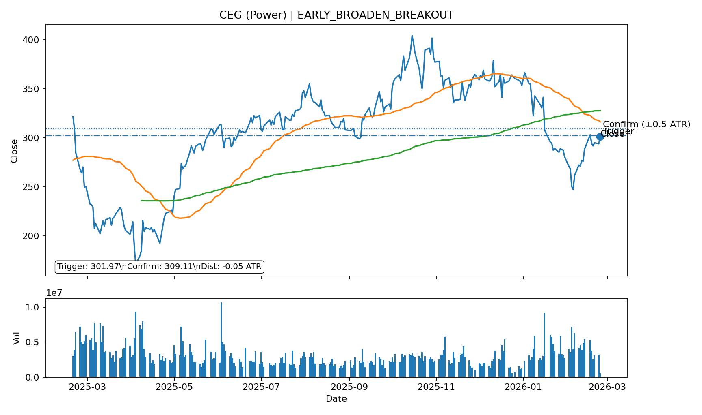
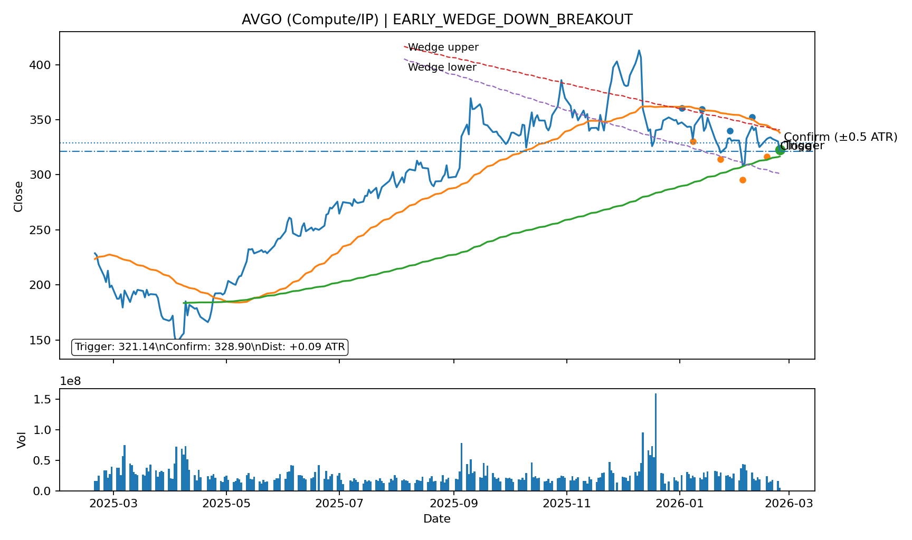
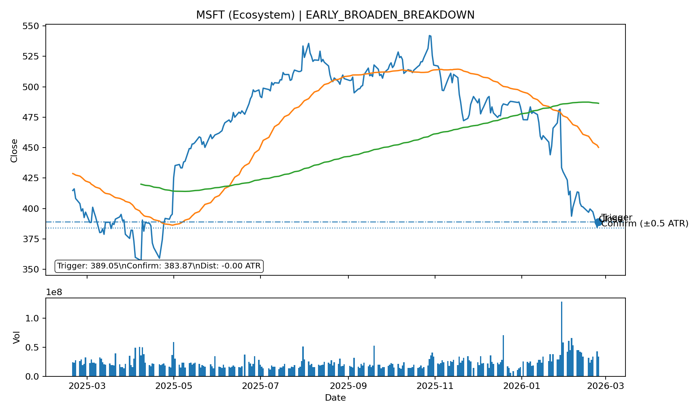
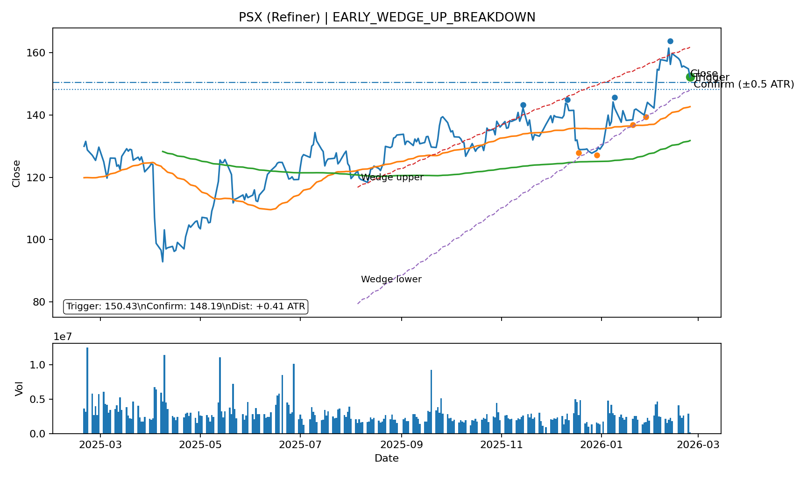

# Daily Report

_Generated: **2026-02-24 15:57 CET**_

## 1) Market recap & positioning

**Executive summary:**

Meta strikes AI chip deal with AMD days: Meta strikes AI chip deal with AMD days after expanding its Nvidia partnership: the Nasdaq rose 0.5% and the S&P 500 edged up 0.2%, while the VIX added 0.3%, as investors weighed fresh AI sector developments against a backdrop of subdued gains this month. Notable watchlist movers included Korea’s SK Hynix up 5.7% and Arm Holdings up 4.8%, while Novo Nordisk tumbled 16.4% after announcing major US price cuts and Synopsys fell 4.3%.

**Key tape (multi-horizon):**

| Instrument       | Last      | 1D                                         | 7D                                         | 1M                                          | 3M                                          | 6M                                          |
| :--- | ---: | ---: | ---: | ---: | ---: | ---: |
| Nasdaq 100       | 24,822.24 | +0.46% | +0.49% | -3.06%  | -1.64%  | +4.72%  |
| S&P 500          | 6,849.30  | +0.17% | +0.09% | -0.96%  | +0.54%  | +5.34%  |
| QQQ              | 604.22    | +0.47% | +0.49% | -2.97%  | -1.64%  | +4.70%  |
| SPY              | 683.38    | +0.15% | +0.08% | -0.85%  | +0.54%  | +5.31%  |
| STOXX Europe 600 | 629.34    | +0.26% | +1.30% | +3.45%  | +9.60%  | +13.67% |
| DAX              | 25,001.78 | +0.04% | +0.01% | +0.41%  | +5.38%  | +4.00%  |
| CAC 40           | 8,520.10  | +0.27% | +1.90% | +4.63%  | +5.23%  | +9.76%  |
| FTSE 100         | 10,692.83 | +0.08% | +1.29% | +5.42%  | +10.33% | +16.01% |
| VIX              | 21.08     | +0.33% | +3.89% | +31.01% | +22.63% | +46.08% |
| EUR/USD          | 1.18      | -0.47% | -0.60% | +0.20%  | +1.85%  | +1.12%  |
| WTI Crude        | 66.52     | +0.32% | +6.72% | +8.92%  | +13.42% | +2.97%  |
| Gold             | 5,154.00  | -0.97% | +5.55% | +3.57%  | +23.74% | +50.18% |
| Coffee           | 281.25    | +0.04% | -1.18% | -19.85% | -31.65% | -27.47% |
| Cocoa            | 3,060.00  | +1.86% | -9.57% | -27.16% | -38.71% | -60.45% |
| Bitcoin          | 63,704.73 | -1.41% | -5.61% | -26.41% | -29.62% | -43.40% |

**Macro charts (5Y):**

<table><tr><td style='padding-right:12px;'></td><td></td></tr></table>

## 2) Biggest movers (≥ 4%)

**Session gainers:**

| Ticker               | pct    |
| :--- | ---: |
| 000660 (Foundry/Mem) | +5.68% |
| ARM (Compute/IP)     | +4.76% |

**Session losers:**

| Ticker       | pct     |
| :--- | ---: |
| NVO (Pharma) | -16.43% |
| SNPS (EDA)   | -4.35%  |

**After-hours gainers:** _None ≥ 4%_

**After-hours losers:** _None ≥ 4%_

## 3) Earnings next 14 days (watchlist)

_Upcoming earnings dates for your 44-ticker watchlist._

| Ticker            | Earnings Date   |   Days |
| :--- | ---: | ---: |
| CEG (Power)       | 2026-02-24      |      0 |
| MELI (E-comm)     | 2026-02-24      |      0 |
| IONQ (Quantum)    | 2026-02-25      |      1 |
| NU (Fintech)      | 2026-02-25      |      1 |
| NVDA (Compute/IP) | 2026-02-25      |      1 |
| SNPS (EDA)        | 2026-02-25      |      1 |
| INSW (Tanker)     | 2026-02-26      |      2 |
| MUV2 (Insurance)  | 2026-02-26      |      2 |
| NAT (Tanker)      | 2026-02-26      |      2 |
| QBTS (Quantum)    | 2026-02-26      |      2 |
| SMR (SMR)         | 2026-02-26      |      2 |
| VST (Power)       | 2026-02-26      |      2 |
| FRO (Tanker)      | 2026-02-27      |      3 |
| ANF (Brands)      | 2026-03-04      |      8 |
| AVGO (Compute/IP) | 2026-03-04      |      8 |

## 4) Technical triggers

### 4) Emerging chart trends (the actual “so what”)

_Logic: score each ticker by stage (CONFIRMED=3, EARLY=1) × direction (BREAKOUT=+1, BREAKDOWN=-1), then aggregate by category._

| Category | Bias | CONF↑ | CONF↓ | EARLY↑ | EARLY↓ |
| :--- | :--- | ---: | ---: | ---: | ---: |
| AI compute & semis (incl. EDA) | Mixed | 0 | 0 | 3 | 1 |
| Big Tech platforms | Mixed | 0 | 0 | 1 | 2 |
| Consumer & retail (incl. luxury) | Mixed | 0 | 0 | 0 | 1 |
| Fintech & financials | Mixed | 0 | 0 | 0 | 2 |
| Healthcare | Mixed | 0 | 0 | 0 | 0 |
| Energy & Nuclear | Mixed | 0 | 0 | 1 | 2 |
| Quantum | Mixed | 0 | 0 | 0 | 0 |
| Venezuela Oil | Mixed | 0 | 0 | 1 | 1 |

### 4A) Early callouts (~80% complete)

_Close enough to pre-plan. “Close enough” = within 0.5 ATR of the trigger (neckline/boundary). No SOFT tier — anything not CONFIRMED stays in EARLY._

**NEW (today):**

| Ticker            | Signal                    |   Close |   Threshold |   Dist(ATR) | Day%   | Chart                                           |
| :--- | :--- | ---: | ---: | ---: | ---: | :--- |
| CEG (Power)       | EARLY_BROADEN_BREAKOUT    |  301.33 |     301.975 |       -0.05 | +2.56% | [chart](img/CEG_EARLY_BROADEN_BREAKOUT.png)     |
| AVGO (Compute/IP) | EARLY_WEDGE_DOWN_BREAKOUT |  322.58 |     321.136 |        0.09 | -2.35% | [chart](img/AVGO_EARLY_WEDGE_DOWN_BREAKOUT.png) |
| MSFT (Ecosystem)  | EARLY_BROADEN_BREAKDOWN   |  386.39 |     389.047 |       -0.26 | +0.50% | [chart](img/MSFT_EARLY_BROADEN_BREAKDOWN.png)   |
| PSX (Refiner)     | EARLY_WEDGE_UP_BREAKDOWN  |  152.27 |     150.434 |        0.41 | -1.66% | [chart](img/PSX_EARLY_WEDGE_UP_BREAKDOWN.png)   |

**What’s going on (NEW early callouts):**

#### CEG (Power) — `EARLY_BROADEN_BREAKOUT`
- **Trigger (level):** 301.97  |  **Close:** 301.33  |  **Distance:** -0.05 ATR
- Chart includes **SMA(50)** + **SMA(200)**, **volume**, plus trigger + confirmation (±0.5 ATR). HS/IHS is labeled (LS/H/RS) with neckline; Wedges include upper/lower trendlines with touch points.
- **Setup:** watch for confirmation close beyond trigger by ≥ 0.5 ATR, or a clean retest/failure in the direction of the signal.

#### AVGO (Compute/IP) — `EARLY_WEDGE_DOWN_BREAKOUT`
- **Trigger (level):** 321.14  |  **Close:** 322.58  |  **Distance:** +0.09 ATR
- Chart includes **SMA(50)** + **SMA(200)**, **volume**, plus trigger + confirmation (±0.5 ATR). HS/IHS is labeled (LS/H/RS) with neckline; Wedges include upper/lower trendlines with touch points.
- **Wedge read:** upper/lower trendlines converge; chart marks recent touch points. Trigger is the boundary; confirmation is ±0.5 ATR beyond.

#### MSFT (Ecosystem) — `EARLY_BROADEN_BREAKDOWN`
- **Trigger (level):** 389.05  |  **Close:** 386.39  |  **Distance:** -0.26 ATR
- Chart includes **SMA(50)** + **SMA(200)**, **volume**, plus trigger + confirmation (±0.5 ATR). HS/IHS is labeled (LS/H/RS) with neckline; Wedges include upper/lower trendlines with touch points.
- **Setup:** watch for confirmation close beyond trigger by ≥ 0.5 ATR, or a clean retest/failure in the direction of the signal.

#### PSX (Refiner) — `EARLY_WEDGE_UP_BREAKDOWN`
- **Trigger (level):** 150.43  |  **Close:** 152.27  |  **Distance:** +0.41 ATR
- Chart includes **SMA(50)** + **SMA(200)**, **volume**, plus trigger + confirmation (±0.5 ATR). HS/IHS is labeled (LS/H/RS) with neckline; Wedges include upper/lower trendlines with touch points.
- **Wedge read:** upper/lower trendlines converge; chart marks recent touch points. Trigger is the boundary; confirmation is ±0.5 ATR beyond.

**ONGOING:**

| Ticker            | Signal                     |   Close |   Threshold |   Dist(ATR) | Day%   | Chart                                            |
| :--- | :--- | ---: | ---: | ---: | ---: | :--- |
| NVDA (Compute/IP) | EARLY_IHS_BREAKOUT         |  191.55 |    191.28   |        0.04 | +0.91% | [chart](img/NVDA_EARLY_IHS_BREAKOUT.png)         |
| NVDA (Compute/IP) | EARLY_BROADEN_BREAKOUT     |  191.55 |    191.907  |       -0.05 | +0.91% | [chart](img/NVDA_EARLY_BROADEN_BREAKOUT.png)     |
| OKLO (SMR)        | EARLY_WEDGE_DOWN_BREAKDOWN |   62.93 |     63.2888 |       -0.06 | -0.25% | [chart](img/OKLO_EARLY_WEDGE_DOWN_BREAKDOWN.png) |
| CVX (Integrated)  | EARLY_WEDGE_UP_BREAKOUT    |  184.58 |    184.313  |        0.08 | -0.18% | [chart](img/CVX_EARLY_WEDGE_UP_BREAKOUT.png)     |
| NFLX (Media)      | EARLY_WEDGE_DOWN_BREAKOUT  |   76.46 |     76.7392 |       -0.11 | +0.57% | [chart](img/NFLX_EARLY_WEDGE_DOWN_BREAKOUT.png)  |
| AMAT (Equipment)  | EARLY_BROADEN_BREAKOUT     |  375.52 |    373.58   |        0.11 | +0.53% | [chart](img/AMAT_EARLY_BROADEN_BREAKOUT.png)     |
| LRCX (Equipment)  | EARLY_WEDGE_UP_BREAKDOWN   |  244.02 |    242.348  |        0.14 | +0.72% | [chart](img/LRCX_EARLY_WEDGE_UP_BREAKDOWN.png)   |
| WMT (Defensive)   | EARLY_BROADEN_BREAKDOWN    |  126.5  |    127.172  |       -0.17 | +0.55% | [chart](img/WMT_EARLY_BROADEN_BREAKDOWN.png)     |
| UCG (Bank/Yield)  | EARLY_HS_TOP_BREAKDOWN     |   72.64 |     72.17   |        0.18 | -1.44% | [chart](img/UCG.MI_EARLY_HS_TOP_BREAKDOWN.png)   |
| ARR (Bank/Yield)  | EARLY_RECT_BREAKDOWN       |   17.93 |     17.7614 |        0.41 | -0.55% | [chart](img/ARR_EARLY_RECT_BREAKDOWN.png)        |
| META (Ads)        | EARLY_BROADEN_BREAKDOWN    |  637.25 |    646.802  |       -0.44 | -2.81% | [chart](img/META_EARLY_BROADEN_BREAKDOWN.png)    |
| CCJ (Uranium)     | EARLY_BROADEN_BREAKDOWN    |  118.46 |    121.432  |       -0.48 | -0.25% | [chart](img/CCJ_EARLY_BROADEN_BREAKDOWN.png)     |

### 4B) Breakouts / breakdowns (or about to)

_Includes **CONFIRMED** only: close beyond trigger by ≥0.5 ATR AND Volume ≥1.25×AvgVol(20) AND CLV ≥+0.70 (breakout) / ≤−0.70 (breakdown)._ 

**NEW (today):**

_None_

**ONGOING:**

_None_

## 5) Needle-moving catalysts (RSS digest)

_Linked digest for drill-down._

- [Meta strikes AI chip deal with AMD days after committing to deploy millions of Nvidia GPUs](https://www.cnbc.com/2026/02/24/meta-to-use-6gw-of-amd-gpus-days-after-expanded-nvidia-ai-chip-deal.html) — CNBC Top News
- [9 of the stock market’s 10 most-watched valuation indicators are now in ‘sell’ territory](https://www.marketwatch.com/story/9-of-the-stock-markets-10-most-watched-valuation-indicators-are-now-in-sell-territory-ebdb9d99?mod=mw_rss_topstories) — MarketWatch Top Stories
- [Warner Bros. Discovery says Paramount made higher bid, board will weigh offer against Netflix deal](https://www.cnbc.com/2026/02/24/warner-bros-discovery-paramount-higher-bid-netflix.html) — CNBC Top News
- [What could save the markets from AI Armageddon? Populist backlash — and it’s already started.](https://www.marketwatch.com/story/what-could-save-the-markets-from-ai-armageddon-populist-backlash-and-its-already-started-9b2aa52d?mod=mw_rss_topstories) — MarketWatch Top Stories
- [Investors seek shelter from AI rout in asset-heavy stocks](https://www.ft.com/content/86b5591a-9e62-4c3f-9e03-7d90d36ed068) — Financial Times
- [Novo Nordisk to slash GLP-1 list prices by up to 50% in U.S. to cut costs for insured patients](https://www.cnbc.com/2026/02/24/novo-nordisk-to-slash-wegovy-ozempic-us-list-prices-by-up-to-50percent.html) — CNBC Top News
- [Savannah Guthrie offers $1 million reward for missing mother Nancy Guthrie](https://www.cnbc.com/2026/02/24/savannah-guthrie-mother-reward-instagram.html) — CNBC Top News
- [Anthropic updates Claude Cowork tool built to give the average office worker a productivity boost](https://www.cnbc.com/2026/02/24/anthropic-claude-cowork-office-worker.html) — CNBC Top News
- [Why the smartest move for Netflix and Paramount is to let the other guy win Warner Bros.](https://www.marketwatch.com/story/why-the-smartest-move-for-netflix-and-paramount-is-to-let-the-other-guy-win-warner-bros-524b7912?mod=mw_rss_topstories) — MarketWatch Top Stories
- [Reform UK plans to use £500bn assets of council pensions to invest in British businesses](https://www.ft.com/content/4541e670-6c81-4819-b27e-39b85415e00a) — Financial Times

## Changelog

**New signals:**

- AVGO|EARLY_WEDGE_DOWN_BREAKOUT
- CEG|EARLY_BROADEN_BREAKOUT
- MSFT|EARLY_BROADEN_BREAKDOWN
- PSX|EARLY_WEDGE_UP_BREAKDOWN

**Ended signals:**

- AVGO|EARLY_IHS_BREAKOUT
- CDNS|EARLY_WEDGE_DOWN_BREAKDOWN
- GOOGL|EARLY_BROADEN_BREAKDOWN
- LLY|EARLY_BROADEN_BREAKOUT
- MELI|CONFIRMED_TRIANGLE_BREAKDOWN
- NU|CONFIRMED_BROADEN_BREAKDOWN
- PSX|EARLY_WEDGE_UP_BREAKOUT
- TSM|EARLY_BROADEN_BREAKOUT
- VST|EARLY_BROADEN_BREAKOUT
## 6) Watchlist performance (all tickers)

Columns: **Close | Day% | CLV | ATR(14) | ATR Δ14d | Vol/AvgVol(20) | 1D | 7D | 1M | 3M**

### AI compute & semis (incl. EDA)

| Ticker | Close | Day% | CLV | ATR(14) | ATR Δ14d | Vol/AvgVol(20) | 1D | 7D | 1M | 3M |
| :--- | ---: | ---: | ---: | ---: | ---: | ---: | ---: | ---: | ---: | ---: |
| ARM (Compute/IP) | 129.3 | +4.5% | +0.7 | 6.1 | +15.3% | 0.1x | +4.5% | +5.8% | +11.4% | -2.4% |
| NVDA (Compute/IP) | 189.8 | -0.9% | +0.0 | 5.8 | +4.4% | 0.2x | -0.9% | +1.5% | +1.1% | +5.1% |
| AVGO (Compute/IP) | 321.6 | -2.7% | +0.5 | 14.4 | +3.0% | 0.2x | -2.7% | -2.9% | +0.5% | -7.3% |
| 000660 (Foundry/Mem) | 1,005,000.0 | +5.7% | +1.0 | 44,171.1 | +15.2% | 0.9x | +5.7% | +14.7% | +35.8% | +78.8% |
| TSM (Foundry/Mem) | 382.1 | +3.3% | +0.9 | 13.1 | +23.7% | 0.2x | +3.3% | +3.8% | +14.1% | +37.7% |
| LRCX (Equipment) | 243.9 | +0.7% | +0.5 | 11.2 | -3.6% | 0.1x | +0.7% | +5.5% | +11.9% | +74.7% |
| ASML (Equipment) | 1,494.2 | +0.6% | +0.3 | 44.9 | -8.3% | 0.2x | +0.6% | +6.2% | +7.6% | +52.3% |
| AMAT (Equipment) | 375.4 | +0.5% | +0.3 | 15.3 | +15.7% | 0.1x | +0.5% | +14.3% | +16.5% | +70.5% |
| CDNS (EDA) | 287.4 | +2.7% | +0.5 | 13.4 | +18.8% | 0.1x | +2.7% | -0.3% | -9.7% | -4.9% |
| SNPS (EDA) | 430.8 | +2.4% | +0.7 | 19.1 | +1.8% | 0.1x | +2.4% | +1.8% | -14.1% | +11.7% |

### Big Tech platforms

| Ticker | Close | Day% | CLV | ATR(14) | ATR Δ14d | Vol/AvgVol(20) | 1D | 7D | 1M | 3M |
| :--- | ---: | ---: | ---: | ---: | ---: | ---: | ---: | ---: | ---: | ---: |
| AMZN (E-comm) | 205.5 | +0.1% | +0.3 | 6.6 | +8.8% | 0.1x | +0.1% | +3.0% | -14.1% | -5.3% |
| MELI (E-comm) | 1,866.1 | +0.1% | -1.0 | 78.8 | +1.6% | 0.2x | +0.1% | -7.0% | -12.7% | -1.8% |
| META (Ads) | 631.0 | -1.0% | -0.6 | 20.0 | -8.3% | 0.1x | -1.0% | -2.9% | -4.2% | +7.1% |
| GOOGL (Ads) | 308.2 | -1.1% | -0.1 | 9.2 | +9.5% | 0.1x | -1.1% | -0.3% | -6.0% | +6.5% |
| AAPL (Ecosystem) | 273.8 | +2.9% | +0.7 | 6.6 | +14.5% | 0.2x | +2.9% | +4.6% | +10.4% | +2.9% |
| MSFT (Ecosystem) | 385.8 | +0.4% | +0.1 | 11.0 | -16.9% | 0.2x | +0.4% | -4.0% | -17.2% | -19.4% |
| NFLX (Media) | 76.2 | +0.2% | +0.0 | 2.5 | +6.0% | 0.1x | +0.2% | +0.4% | -11.5% | -27.9% |

### Consumer & retail (incl. luxury)

| Ticker | Close | Day% | CLV | ATR(14) | ATR Δ14d | Vol/AvgVol(20) | 1D | 7D | 1M | 3M |
| :--- | ---: | ---: | ---: | ---: | ---: | ---: | ---: | ---: | ---: | ---: |
| WMT (Defensive) | 126.6 | +0.7% | +0.5 | 3.4 | +31.1% | 0.1x | +0.7% | -5.2% | +7.6% | +18.2% |
| RRTL (Defensive) | 36.8 | -0.1% | -0.2 | 0.7 | +0.0% | 0.4x | -0.1% | +2.1% | -0.1% | +12.7% |
| ANF (Brands) | 94.9 | +2.4% | +0.7 | 4.9 | -3.5% | 0.1x | +2.4% | +3.2% | -1.5% | +39.9% |
| DECK (Brands) | 118.3 | +0.1% | -0.4 | 4.0 | -17.1% | 0.1x | +0.1% | +2.0% | +18.3% | +45.2% |
| MC (Luxury) | 565.7 | +1.4% | +0.9 | 14.8 | -6.1% | 0.3x | +1.4% | +10.0% | -3.8% | -9.0% |
| RMS (Luxury) | 2,120.0 | +0.7% | +0.9 | 53.6 | +10.1% | 0.2x | +0.7% | -1.3% | -0.9% | +0.5% |
| BYDDY (Services) | 12.7 | +0.5% | +1.0 | 0.3 | -14.6% | 0.0x | +0.5% | +2.0% | -0.8% | +6.4% |
| DASH (Services) | 164.7 | +0.0% | -1.0 | 9.4 | +24.8% | 0.2x | +0.0% | +2.2% | -20.5% | -12.2% |
| CMG (Services) | 36.3 | -0.8% | -0.7 | 1.3 | +16.5% | 0.1x | -0.8% | +1.3% | -11.2% | +19.6% |

### Fintech & financials

| Ticker | Close | Day% | CLV | ATR(14) | ATR Δ14d | Vol/AvgVol(20) | 1D | 7D | 1M | 3M |
| :--- | ---: | ---: | ---: | ---: | ---: | ---: | ---: | ---: | ---: | ---: |
| HOOD (Brokerage) | 70.8 | -1.4% | +0.5 | 5.5 | -0.4% | 0.1x | -1.4% | -0.5% | -33.9% | -33.4% |
| NU (Fintech) | 16.0 | -1.3% | -0.6 | 0.6 | +12.6% | 0.1x | -1.3% | -6.3% | -11.4% | +4.3% |
| MUV2 (Insurance) | 552.2 | +1.7% | +0.8 | 8.5 | +0.3% | 0.4x | +1.7% | +4.1% | +9.0% | +4.0% |
| PGR (Insurance) | 203.8 | +0.1% | +0.8 | 5.2 | -4.5% | 0.1x | +0.1% | -0.8% | -1.1% | -9.8% |
| ARR (Bank/Yield) | 17.9 | -0.6% | -0.1 | 0.4 | +1.6% | 0.1x | -0.6% | -1.2% | -2.3% | +9.9% |
| UCG (Bank/Yield) | 72.6 | -1.4% | +0.2 | 2.1 | +41.6% | 0.5x | -1.4% | +1.8% | +0.4% | +15.6% |

### Healthcare

| Ticker | Close | Day% | CLV | ATR(14) | ATR Δ14d | Vol/AvgVol(20) | 1D | 7D | 1M | 3M |
| :--- | ---: | ---: | ---: | ---: | ---: | ---: | ---: | ---: | ---: | ---: |
| ISRG (Medtech) | 492.3 | +0.0% | +0.1 | 13.1 | -4.2% | 0.1x | +0.0% | +2.9% | -6.1% | -10.9% |
| LLY (Pharma) | 1,043.1 | -1.5% | +0.2 | 37.7 | +18.7% | 0.2x | -1.5% | +0.5% | -2.0% | -0.0% |
| NVO (Pharma) | 38.9 | -1.8% | +0.8 | 2.5 | -2.7% | 0.5x | -1.8% | -20.4% | -37.5% | -18.2% |

### Energy & Nuclear

| Ticker | Close | Day% | CLV | ATR(14) | ATR Δ14d | Vol/AvgVol(20) | 1D | 7D | 1M | 3M |
| :--- | ---: | ---: | ---: | ---: | ---: | ---: | ---: | ---: | ---: | ---: |
| CEG (Power) | 302.3 | +2.9% | +0.7 | 13.7 | +2.8% | 0.1x | +2.9% | +9.5% | +4.6% | -12.6% |
| VST (Power) | 166.6 | -0.7% | +0.4 | 7.2 | -10.1% | 0.1x | -0.7% | +2.1% | +4.0% | -4.1% |
| CCJ (Uranium) | 118.1 | -0.5% | +0.7 | 5.9 | -3.0% | 0.1x | -0.5% | +1.5% | -4.8% | +44.1% |
| LEU (FuelCycle) | 195.4 | -2.8% | +0.5 | 23.4 | -20.5% | 0.1x | -2.8% | +5.5% | -34.0% | -19.0% |
| SMR (SMR) | 12.6 | +0.1% | +0.7 | 1.5 | -10.4% | 0.2x | +0.1% | -9.8% | -36.2% | -32.6% |
| OKLO (SMR) | 62.8 | -0.4% | +0.5 | 6.4 | -18.4% | 0.1x | -0.4% | -1.7% | -28.3% | -28.6% |

### Quantum

| Ticker | Close | Day% | CLV | ATR(14) | ATR Δ14d | Vol/AvgVol(20) | 1D | 7D | 1M | 3M |
| :--- | ---: | ---: | ---: | ---: | ---: | ---: | ---: | ---: | ---: | ---: |
| QBTS (Quantum) | 18.4 | +1.7% | +0.3 | 1.8 | -16.8% | 0.1x | +1.7% | -2.4% | -28.3% | -10.5% |
| IONQ (Quantum) | 31.0 | +0.8% | +0.4 | 3.1 | -20.1% | 0.2x | +0.8% | -0.9% | -34.3% | -24.3% |

### Venezuela Oil

| Ticker | Close | Day% | CLV | ATR(14) | ATR Δ14d | Vol/AvgVol(20) | 1D | 7D | 1M | 3M |
| :--- | ---: | ---: | ---: | ---: | ---: | ---: | ---: | ---: | ---: | ---: |
| TNK (Tanker) | 72.8 | +1.4% | +0.8 | 2.2 | +0.9% | 0.1x | +1.4% | +6.4% | +17.9% | +20.3% |
| FRO (Tanker) | 35.6 | +1.3% | +0.3 | 1.0 | +15.6% | 0.3x | +1.3% | +19.8% | +36.4% | +42.3% |
| INSW (Tanker) | 67.9 | +1.3% | +0.8 | 1.8 | -7.0% | 0.1x | +1.3% | +9.4% | +18.6% | +28.1% |
| NAT (Tanker) | 4.9 | +0.0% | -0.2 | 0.1 | +0.4% | 0.2x | +0.0% | +10.3% | +21.2% | +31.9% |
| MPC (Refiner) | 192.3 | -0.3% | +0.3 | 6.2 | +4.6% | 0.0x | -0.3% | -2.9% | +9.7% | +2.4% |
| VLO (Refiner) | 195.6 | -0.9% | -0.3 | 6.1 | -8.9% | 0.1x | -0.9% | -0.7% | +4.5% | +14.5% |
| PSX (Refiner) | 152.4 | -1.6% | -0.9 | 4.3 | +3.5% | 0.1x | -1.6% | -2.5% | +7.6% | +15.4% |
| CVX (Integrated) | 184.6 | -0.2% | -0.3 | 3.3 | -3.2% | 0.1x | -0.2% | +1.2% | +10.7% | +22.8% |
| REP (Integrated) | 18.5 | -0.2% | -0.9 | 0.5 | +2.0% | 0.3x | -0.2% | +8.8% | +15.7% | +18.5% |
| MAU (Upstream) | 8.9 | +1.1% | -0.2 | 0.3 | +43.0% | 0.4x | +1.1% | +14.9% | +35.3% | +86.0% |
