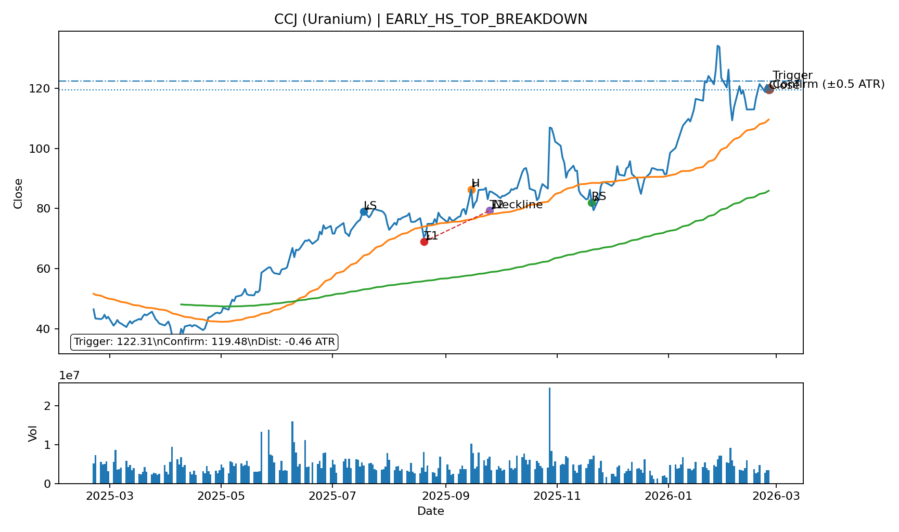
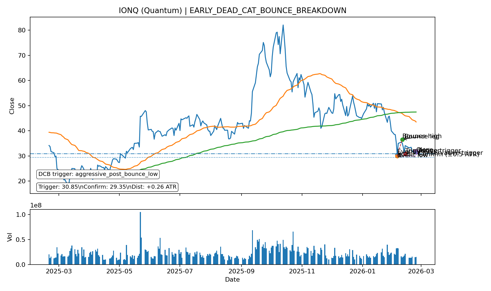
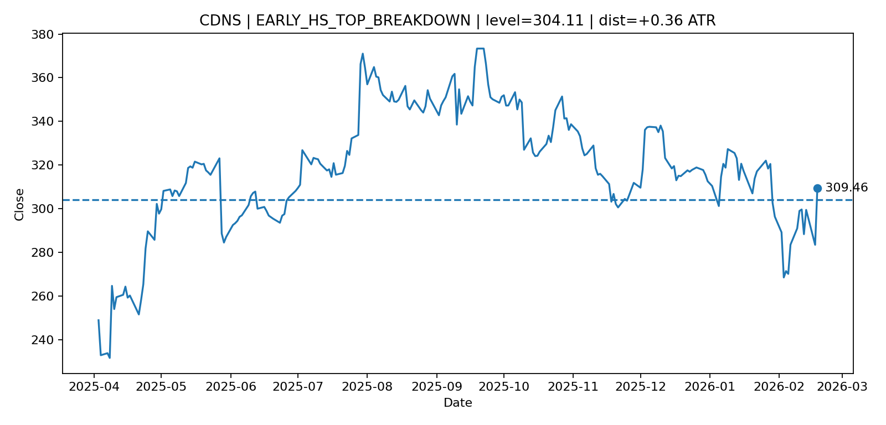
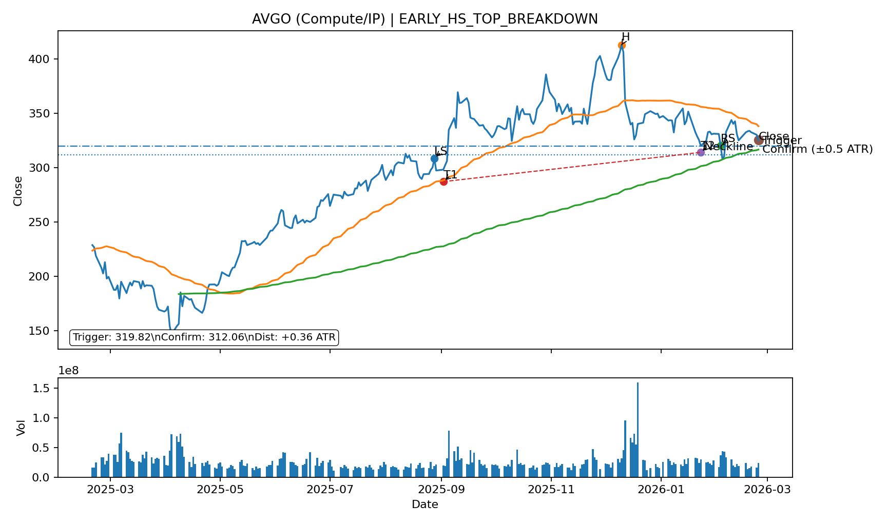
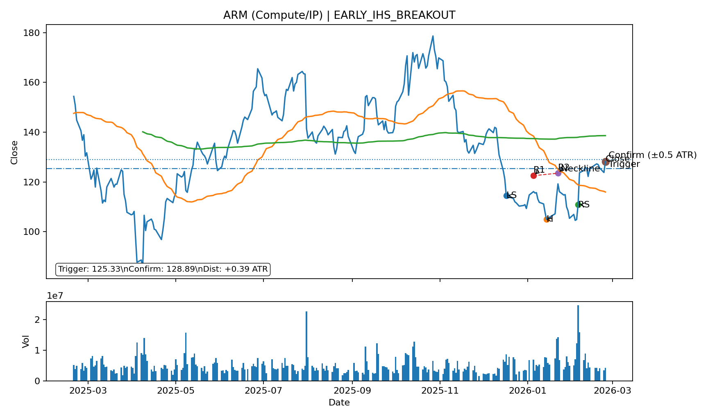
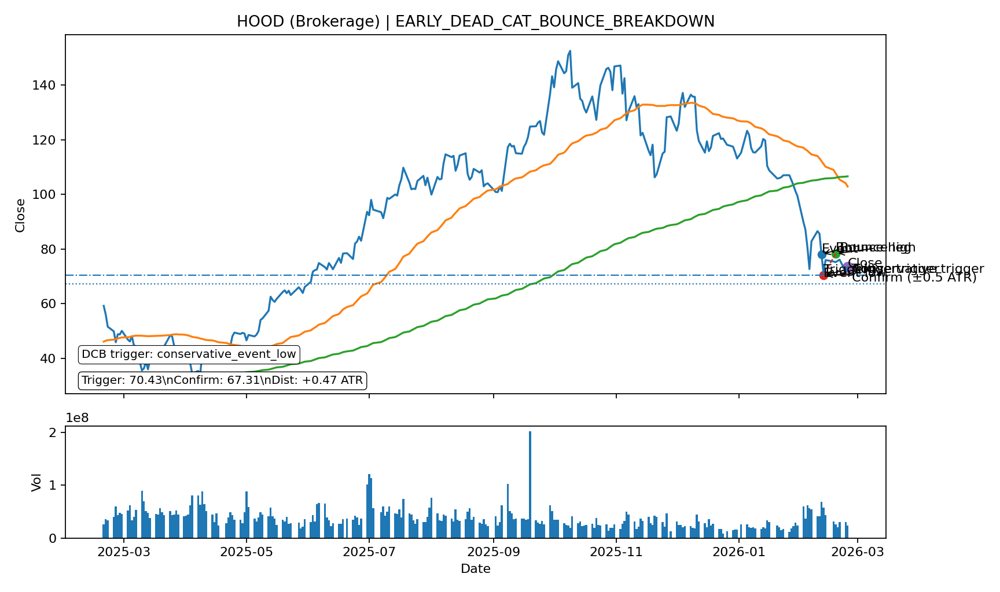

# Daily Report

_Generated: **2026-02-25 15:23 CET**_

## 1) Market recap & positioning

**Executive summary:**

Headline: AI hardware optimism and an earnings beat from Lowe’s kept the focus on tech and guidance as investors worked through the day’s key watchpoints. The Nasdaq 100 rose 1.1% and the S&P 500 gained 0.8% while the Vix fell 3.9%, extending a steadier tone after this month’s choppier pullback (NDX -2.5% 1M). Biggest movers on the watchlist were SMR up 6.6%, CEG (Power) up 6.4% and SNPS (EDA) up 4.7%, with no ≥4% decliners flagged.

**Key tape (multi-horizon):**

| Instrument       | Last      | 1D                                         | 7D                                          | 1M                                          | 3M                                          | 6M                                           |
| :--- | ---: | ---: | ---: | ---: | ---: | ---: |
| Nasdaq 100       | 24,977.04 | +1.09% | +1.12%  | -2.45%  | -1.03%  | +5.37%   |
| S&P 500          | 6,890.07  | +0.77% | +0.68%  | -0.37%  | +1.14%  | +5.97%   |
| QQQ              | 607.87    | +1.07% | +1.09%  | -2.38%  | -1.04%  | +5.34%   |
| SPY              | 687.35    | +0.73% | +0.66%  | -0.27%  | +1.13%  | +5.92%   |
| STOXX Europe 600 | 633.34    | +0.67% | +0.74%  | +3.90%  | +10.15% | +15.12%  |
| DAX              | 25,147.69 | +0.65% | -0.52%  | +0.86%  | +5.80%  | +5.21%   |
| CAC 40           | 8,558.81  | +0.46% | +1.54%  | +5.26%  | +5.67%  | +11.10%  |
| FTSE 100         | 10,786.34 | +0.99% | +0.94%  | +6.28%  | +11.27% | +17.40%  |
| VIX              | 18.79     | -3.89% | -4.23%  | +16.35% | +9.31%  | +22.33%  |
| EUR/USD          | 1.18      | -0.07% | -0.56%  | -0.62%  | +1.58%  | +0.89%   |
| WTI Crude        | 65.90     | +0.41% | +1.09%  | +8.69%  | +12.36% | +2.95%   |
| Gold             | 5,206.30  | +0.98% | +4.41%  | +2.49%  | +25.00% | +49.88%  |
| Silver           | 91.38     | +4.49% | +17.90% | -20.59% | +72.69% | +127.31% |
| Coffee           | 282.40    | -2.03% | -1.79%  | -20.73% | -31.37% | -28.84%  |
| Cocoa            | 3,107.00  | +3.67% | -3.69%  | -28.54% | -37.77% | -59.31%  |
| Bitcoin          | 66,548.66 | +3.85% | +0.19%  | -24.61% | -27.10% | -38.61%  |

**Macro charts (5Y):**

<table><tr><td style='padding-right:12px;'></td><td></td></tr></table>

## 2) Biggest movers (≥ 4%)

**Session gainers:**

| Ticker            | pct    |
| :--- | ---: |
| SMR (SMR)         | +6.59% |
| CEG (Power)       | +6.41% |
| SNPS (EDA)        | +4.73% |
| TSM (Foundry/Mem) | +4.25% |
| FRO (Tanker)      | +4.08% |
| INSW (Tanker)     | +4.06% |

**Session losers:** _None ≥ 4%_

**After-hours gainers:** _None ≥ 4%_

**After-hours losers:** _None ≥ 4%_

## 3) Earnings next 14 days (watchlist)

_Upcoming earnings dates for your 44-ticker watchlist._

| Ticker            | Earnings Date   |   Days |
| :--- | ---: | ---: |
| IONQ (Quantum)    | 2026-02-25      |      0 |
| NU (Fintech)      | 2026-02-25      |      0 |
| NVDA (Compute/IP) | 2026-02-25      |      0 |
| SNPS (EDA)        | 2026-02-25      |      0 |
| INSW (Tanker)     | 2026-02-26      |      1 |
| MUV2 (Insurance)  | 2026-02-26      |      1 |
| NAT (Tanker)      | 2026-02-26      |      1 |
| QBTS (Quantum)    | 2026-02-26      |      1 |
| SMR (SMR)         | 2026-02-26      |      1 |
| VST (Power)       | 2026-02-26      |      1 |
| FRO (Tanker)      | 2026-02-27      |      2 |
| ANF (Brands)      | 2026-03-04      |      7 |
| AVGO (Compute/IP) | 2026-03-04      |      7 |

## 4) Technical triggers

### 4) Watchlist emerging chart trends

_Logic: score each ticker by stage (CONFIRMED=3, EARLY=1) × direction (BREAKOUT=+1, BREAKDOWN=-1), then aggregate by category._

| Category | Bias | CONF↑ | CONF↓ | EARLY↑ | EARLY↓ |
| :--- | :--- | ---: | ---: | ---: | ---: |
| AI compute & semis (incl. EDA) | Mixed | 0 | 0 | 1 | 2 |
| Big Tech platforms | Mixed | 0 | 0 | 0 | 0 |
| Consumer & retail (incl. luxury) | Mixed | 0 | 0 | 0 | 1 |
| Fintech & financials | Mixed | 0 | 0 | 0 | 2 |
| Healthcare | Mixed | 0 | 0 | 0 | 0 |
| Energy & Nuclear | Mixed | 0 | 0 | 0 | 1 |
| Quantum | Mixed | 0 | 0 | 0 | 1 |
| Venezuela Oil | Bullish | 1 | 0 | 0 | 0 |

### 4A) Early callouts (~80% complete)

_Close enough to pre-plan. “Close enough” = within 0.5 ATR of the trigger (neckline/boundary). No SOFT tier — anything not CONFIRMED stays in EARLY._

**NEW (today):**

| Ticker            | Signal                          |   Close |   Threshold |   Dist(ATR) | Day%   | Chart                                                 |
| :--- | :--- | ---: | ---: | ---: | ---: | :--- |
| CCJ (Uranium)     | EARLY_HS_TOP_BREAKDOWN          |  121.08 |    121.901  |       -0.13 | +1.96% | [chart](img/CCJ_EARLY_HS_TOP_BREAKDOWN.png)           |
| IONQ (Quantum)    | EARLY_DEAD_CAT_BOUNCE_BREAKDOWN |   31.62 |     30.85   |        0.26 | +2.73% | [chart](img/IONQ_EARLY_DEAD_CAT_BOUNCE_BREAKDOWN.png) |
| CDNS (EDA)        | EARLY_HS_TOP_BREAKDOWN          |  290.63 |    286.782  |        0.27 | +3.87% | [chart](img/CDNS_EARLY_HS_TOP_BREAKDOWN.png)          |
| NU (Fintech)      | EARLY_HS_TOP_BREAKDOWN          |   16.53 |     16.7762 |       -0.34 | +2.10% | [chart](img/NU_EARLY_HS_TOP_BREAKDOWN.png)            |
| AVGO (Compute/IP) | EARLY_HS_TOP_BREAKDOWN          |  325.49 |    319.825  |        0.36 | -1.47% | [chart](img/AVGO_EARLY_HS_TOP_BREAKDOWN.png)          |
| ARM (Compute/IP)  | EARLY_IHS_BREAKOUT              |  128.14 |    125.333  |        0.39 | +3.52% | [chart](img/ARM_EARLY_IHS_BREAKOUT.png)               |
| ANF (Brands)      | EARLY_HS_TOP_BREAKDOWN          |   94.99 |     92.5689 |        0.47 | +2.57% | [chart](img/ANF_EARLY_HS_TOP_BREAKDOWN.png)           |
| HOOD (Brokerage)  | EARLY_DEAD_CAT_BOUNCE_BREAKDOWN |   73.39 |     70.43   |        0.47 | +2.24% | [chart](img/HOOD_EARLY_DEAD_CAT_BOUNCE_BREAKDOWN.png) |

**What’s going on (NEW early callouts):**

#### CCJ (Uranium) — `EARLY_HS_TOP_BREAKDOWN`
- **Trigger (level):** 121.90  |  **Close:** 121.08  |  **Distance:** -0.13 ATR
- Chart includes **SMA(50)** + **SMA(200)**, **volume**, plus trigger + confirmation (±0.5 ATR). HS/IHS is labeled (LS/H/RS) with neckline; Wedges include upper/lower trendlines with touch points.
- **HS/IHS read:** neckline is the trigger; chart labels LS/H/RS and draws the neckline + confirmation band.

#### IONQ (Quantum) — `EARLY_DEAD_CAT_BOUNCE_BREAKDOWN`
- **Trigger (level):** 30.85  |  **Close:** 31.62  |  **Distance:** +0.26 ATR
- Chart includes **SMA(50)** + **SMA(200)**, **volume**, plus trigger + confirmation (±0.5 ATR). HS/IHS is labeled (LS/H/RS) with neckline; Wedges include upper/lower trendlines with touch points.
- **Setup:** watch for confirmation close beyond trigger by ≥ 0.5 ATR, or a clean retest/failure in the direction of the signal.

#### CDNS (EDA) — `EARLY_HS_TOP_BREAKDOWN`
- **Trigger (level):** 286.78  |  **Close:** 290.63  |  **Distance:** +0.27 ATR
- Chart includes **SMA(50)** + **SMA(200)**, **volume**, plus trigger + confirmation (±0.5 ATR). HS/IHS is labeled (LS/H/RS) with neckline; Wedges include upper/lower trendlines with touch points.
- **HS/IHS read:** neckline is the trigger; chart labels LS/H/RS and draws the neckline + confirmation band.

#### NU (Fintech) — `EARLY_HS_TOP_BREAKDOWN`
- **Trigger (level):** 16.78  |  **Close:** 16.53  |  **Distance:** -0.34 ATR
- Chart includes **SMA(50)** + **SMA(200)**, **volume**, plus trigger + confirmation (±0.5 ATR). HS/IHS is labeled (LS/H/RS) with neckline; Wedges include upper/lower trendlines with touch points.
- **HS/IHS read:** neckline is the trigger; chart labels LS/H/RS and draws the neckline + confirmation band.

#### AVGO (Compute/IP) — `EARLY_HS_TOP_BREAKDOWN`
- **Trigger (level):** 319.82  |  **Close:** 325.49  |  **Distance:** +0.36 ATR
- Chart includes **SMA(50)** + **SMA(200)**, **volume**, plus trigger + confirmation (±0.5 ATR). HS/IHS is labeled (LS/H/RS) with neckline; Wedges include upper/lower trendlines with touch points.
- **HS/IHS read:** neckline is the trigger; chart labels LS/H/RS and draws the neckline + confirmation band.

#### ARM (Compute/IP) — `EARLY_IHS_BREAKOUT`
- **Trigger (level):** 125.33  |  **Close:** 128.14  |  **Distance:** +0.39 ATR
- Chart includes **SMA(50)** + **SMA(200)**, **volume**, plus trigger + confirmation (±0.5 ATR). HS/IHS is labeled (LS/H/RS) with neckline; Wedges include upper/lower trendlines with touch points.
- **HS/IHS read:** neckline is the trigger; chart labels LS/H/RS and draws the neckline + confirmation band.

#### ANF (Brands) — `EARLY_HS_TOP_BREAKDOWN`
- **Trigger (level):** 92.57  |  **Close:** 94.99  |  **Distance:** +0.47 ATR
- Chart includes **SMA(50)** + **SMA(200)**, **volume**, plus trigger + confirmation (±0.5 ATR). HS/IHS is labeled (LS/H/RS) with neckline; Wedges include upper/lower trendlines with touch points.
- **HS/IHS read:** neckline is the trigger; chart labels LS/H/RS and draws the neckline + confirmation band.

#### HOOD (Brokerage) — `EARLY_DEAD_CAT_BOUNCE_BREAKDOWN`
- **Trigger (level):** 70.43  |  **Close:** 73.39  |  **Distance:** +0.47 ATR
- Chart includes **SMA(50)** + **SMA(200)**, **volume**, plus trigger + confirmation (±0.5 ATR). HS/IHS is labeled (LS/H/RS) with neckline; Wedges include upper/lower trendlines with touch points.
- **Setup:** watch for confirmation close beyond trigger by ≥ 0.5 ATR, or a clean retest/failure in the direction of the signal.

**ONGOING:**

_None_

### 4B) Confirmed breakouts / breakdowns (watchlist + MSCI World)

_Includes **CONFIRMED** only: close beyond trigger by ≥0.5 ATR AND Volume ≥1.25×AvgVol(20) AND CLV ≥+0.70 (breakout) / ≤−0.70 (breakdown). Categories keep watchlist custom buckets; non-watchlist MSCI names use S&P 500 11-sector labels._ 

**NEW (today):**

| Name of Company          | Ticker       | Country       | Category   | Signal                              |   Close |   Threshold |   Dist(ATR) | Day%   | Chart                                                     |
| :--- | :--- | :--- | :--- | :--- | ---: | ---: | ---: | ---: | :--- |
| INTUIT INC               | INTU         | United States |            | CONFIRMED_DEAD_CAT_BOUNCE_BREAKDOWN |  358.71 |    375.4    |       -0.75 | -0.23% | [chart](img/INTU_CONFIRMED_DEAD_CAT_BOUNCE_BREAKDOWN.png) |
| TNK                      | TNK (Tanker) | United States |            | CONFIRMED_IHS_BREAKOUT              |   73.82 |     61.6214 |        5.29 | +2.78% | [chart](img/TNK_CONFIRMED_IHS_BREAKOUT.png)               |
| TEXAS PACIFIC LAND CORP  | TPL          | United States |            | CONFIRMED_IHS_BREAKOUT              |  531.95 |    306.864  |        8.44 | +5.79% | [chart](img/TPL_CONFIRMED_IHS_BREAKOUT.png)               |
| MURATA MANUFACTURING LTD | 6981         | Japan         |            | CONFIRMED_RECT_TOP_BREAKOUT         | 4223    |   3377.85   |        5.37 | +4.40% | [chart](img/6981.T_CONFIRMED_RECT_TOP_BREAKOUT.png)       |

**ONGOING:**

_None_

## 5) Needle-moving catalysts (RSS digest)

_Linked digest for drill-down._

- [David Tepper sends scathing letter to Whirlpool for destroying shareholder value, pushes for changes](https://www.cnbc.com/2026/02/25/david-tepper-sends-scathing-letter-to-whirlpool.html) — CNBC Top News
- [Anthropic faces Friday deadline in Defense AI clash with Hegseth](https://www.cnbc.com/2026/02/24/anthropic-ai-hegseth-spying-defense.html) — CNBC Top News
- [These are the 2026 CNBC Changemakers: See the full list of women transforming business](https://www.cnbc.com/2026/02/25/changemakers-list-women-business-leadership.html) — CNBC Top News
- [Jim Cramer's top 10 things to watch in the stock market Wednesday](https://www.cnbc.com/2026/02/25/jim-cramers-top-10-things-to-watch-in-the-stock-market-wednesday.html) — CNBC Top News
- [Lowe's earnings beat as sales jump more than 10% despite sluggish housing market](https://www.cnbc.com/2026/02/25/lowes-low-q4-2025-earnings.html) — CNBC Top News
- [‘I am fearful’: My ailing relative is being forced into assisted living. What can I do?](https://www.marketwatch.com/story/i-am-fearful-my-ailing-relative-is-being-forced-into-assisted-living-what-can-i-do-7ce8b42a?mod=mw_rss_topstories) — MarketWatch Top Stories
- [HSBC reports a beat and a raise as it leapfrogs Wells Fargo by market cap](https://www.marketwatch.com/story/hsbc-reports-a-beat-and-a-raise-as-it-leapfrogs-wells-fargo-by-market-cap-0e9f15ee?mod=mw_rss_topstories) — MarketWatch Top Stories
- [‘I spend $7,500 a month’: I’m 47, earn $260K, and have $3 million. Can I retire at 50?](https://www.marketwatch.com/story/i-spend-7-500-a-month-im-47-earn-260k-and-have-3-million-can-i-retire-at-50-05afc0b5?mod=mw_rss_topstories) — MarketWatch Top Stories
- [Why this investor says you can make good money off software stocks — if you trade them like telephone directories](https://www.marketwatch.com/story/why-this-investor-says-you-can-make-good-money-off-software-stocks-if-you-trade-them-like-telephone-directories-e4d15635?mod=mw_rss_topstories) — MarketWatch Top Stories
- [Mortgage rates hit lowest level in nearly 4 years, but homebuyers are still stuck on the sidelines](https://www.cnbc.com/2026/02/25/mortgage-rates-hit-lowest-level-in-nearly-4-years.html) — CNBC Top News

## Changelog

**New signals:**

- 6981.T|CONFIRMED_RECT_TOP_BREAKOUT
- ANF|EARLY_HS_TOP_BREAKDOWN
- ARM|EARLY_IHS_BREAKOUT
- AVGO|EARLY_HS_TOP_BREAKDOWN
- CCJ|EARLY_HS_TOP_BREAKDOWN
- CDNS|EARLY_HS_TOP_BREAKDOWN
- HOOD|EARLY_DEAD_CAT_BOUNCE_BREAKDOWN
- INTU|CONFIRMED_DEAD_CAT_BOUNCE_BREAKDOWN
- IONQ|EARLY_DEAD_CAT_BOUNCE_BREAKDOWN
- NU|EARLY_HS_TOP_BREAKDOWN
- TNK|CONFIRMED_IHS_BREAKOUT
- TPL|CONFIRMED_IHS_BREAKOUT

**Ended signals:**

- 0002.HK|CONFIRMED_WEDGE_UP_BREAKDOWN
- 5803.T|CONFIRMED_BROADEN_BREAKOUT
- 6981.T|CONFIRMED_TRIANGLE_BREAKOUT
- AAPL|EARLY_BROADEN_BREAKOUT
- AAPL|EARLY_IHS_BREAKOUT
- ACA|CONFIRMED_IHS_BREAKOUT
- AMAT|EARLY_BROADEN_BREAKOUT
- AMZN|EARLY_BROADEN_BREAKDOWN
- ARR|EARLY_RECT_BREAKOUT
- AVGO|EARLY_WEDGE_DOWN_BREAKOUT
- BYDDY|EARLY_RECT_BREAKOUT
- C6L.SI|CONFIRMED_RECT_BREAKOUT
- CCJ|EARLY_BROADEN_BREAKDOWN
- CCL-B.TO|CONFIRMED_BROADEN_BREAKOUT
- CVX|EARLY_WEDGE_UP_BREAKOUT
- META|EARLY_BROADEN_BREAKDOWN
- MSFT|EARLY_BROADEN_BREAKDOWN
- NAT|CONFIRMED_RECT_BREAKOUT
- NRG|CONFIRMED_BROADEN_BREAKOUT
- NVDA|EARLY_BROADEN_BREAKOUT
- NVDA|EARLY_IHS_BREAKOUT
- OKLO|EARLY_WEDGE_DOWN_BREAKDOWN
- PPL|CONFIRMED_RECT_BREAKOUT
- PSX|EARLY_WEDGE_UP_BREAKOUT
## 6) Watchlist performance (all tickers)

Columns: **Close | Day% | CLV | ATR(14) | ATR Δ14d | Vol/AvgVol(20) | 1D | 7D | 1M | 3M**

### AI compute & semis (incl. EDA)

| Ticker | Close | Day% | CLV | ATR(14) | ATR Δ14d | Vol/AvgVol(20) | 1D | 7D | 1M | 3M |
| :--- | ---: | ---: | ---: | ---: | ---: | ---: | ---: | ---: | ---: | ---: |
| AVGO (Compute/IP) | 333.7 | +2.5% | +0.2 | 14.1 | -4.5% | 0.0x | +2.5% | +2.6% | +2.7% | -1.9% |
| ARM (Compute/IP) | 130.0 | +1.4% | +0.6 | 5.9 | +11.8% | 0.0x | +1.4% | +3.8% | +13.3% | -1.2% |
| NVDA (Compute/IP) | 194.3 | +0.8% | -0.4 | 5.7 | -1.9% | 0.1x | +0.8% | +6.3% | +4.2% | +8.6% |
| SK Hynix (Foundry/Mem) | 1,018,000.0 | +1.3% | -0.2 | 43,444.6 | +5.3% | 0.7x | +1.3% | +18.4% | +34.8% | +78.3% |
| TSM (Foundry/Mem) | 387.3 | +0.4% | -0.3 | 13.0 | +15.0% | 0.1x | +0.4% | +5.7% | +16.4% | +40.8% |
| LRCX (Equipment) | 253.4 | +3.8% | +0.7 | 11.2 | -11.2% | 0.0x | +3.8% | +7.6% | +13.7% | +77.7% |
| AMAT (Equipment) | 388.9 | +2.9% | +0.8 | 15.1 | +1.5% | 0.1x | +2.9% | +9.6% | +21.7% | +73.6% |
| ASML (Equipment) | 1,525.0 | +1.8% | +0.7 | 43.9 | -15.3% | 0.1x | +1.8% | +8.4% | +7.9% | +57.8% |
| CDNS (EDA) | 296.4 | +2.0% | -0.1 | 13.3 | +19.0% | 0.0x | +2.0% | -1.0% | -7.9% | -1.4% |
| SNPS (EDA) | 444.5 | +0.8% | +0.1 | 19.0 | +0.7% | 0.1x | +0.8% | +1.7% | -11.6% | +14.4% |

### Big Tech platforms

| Ticker | Close | Day% | CLV | ATR(14) | ATR Δ14d | Vol/AvgVol(20) | 1D | 7D | 1M | 3M |
| :--- | ---: | ---: | ---: | ---: | ---: | ---: | ---: | ---: | ---: | ---: |
| AMZN (E-comm) | 210.2 | +0.8% | -0.9 | 6.6 | +7.0% | 0.0x | +0.8% | +5.7% | -11.8% | -4.8% |
| MELI (E-comm) | 1,717.5 | -10.7% | +0.1 | 93.7 | +16.9% | 0.6x | -10.7% | -13.6% | -22.4% | -12.0% |
| META (Ads) | 643.4 | +0.6% | -0.3 | 19.2 | -12.5% | 0.0x | +0.6% | +0.6% | -4.3% | +8.3% |
| GOOGL (Ads) | 310.8 | -0.0% | -0.1 | 8.8 | -0.9% | 0.0x | -0.0% | +1.7% | -6.7% | +3.7% |
| MSFT (Ecosystem) | 392.7 | +0.9% | +0.4 | 10.5 | -19.1% | 0.1x | +0.9% | -2.2% | -16.5% | -16.8% |
| AAPL (Ecosystem) | 272.0 | -0.0% | +0.0 | 6.2 | +3.1% | 0.0x | -0.0% | +6.4% | +6.5% | +0.2% |
| NFLX (Media) | 80.2 | +2.8% | +0.6 | 2.6 | +9.1% | 0.1x | +2.8% | +4.4% | -6.4% | -23.1% |

### Consumer & retail (incl. luxury)

| Ticker | Close | Day% | CLV | ATR(14) | ATR Δ14d | Vol/AvgVol(20) | 1D | 7D | 1M | 3M |
| :--- | ---: | ---: | ---: | ---: | ---: | ---: | ---: | ---: | ---: | ---: |
| RRTL (Defensive) | 36.7 | +0.3% | +0.5 | 0.7 | +1.0% | 0.2x | +0.3% | +2.9% | -1.1% | +10.4% |
| WMT (Defensive) | 126.9 | +0.1% | +0.2 | 3.3 | +27.1% | 0.0x | +0.1% | -5.2% | +7.9% | +20.5% |
| DECK (Brands) | 121.5 | +0.5% | +0.1 | 3.9 | -18.2% | 0.0x | +0.5% | +5.0% | +19.9% | +42.7% |
| ANF (Brands) | 94.5 | -0.5% | +1.0 | 4.8 | -6.6% | 0.0x | -0.5% | +0.9% | -2.6% | +35.3% |
| RMS (Luxury) | 2,068.0 | -0.6% | -0.9 | 52.8 | +7.7% | 0.2x | -0.6% | -0.6% | -2.9% | -2.7% |
| MC (Luxury) | 555.7 | -1.1% | -0.6 | 14.8 | -3.6% | 0.3x | -1.1% | +7.2% | -5.7% | -10.3% |
| BYDDY (Services) | 12.8 | +1.1% | +0.4 | 0.3 | -12.0% | 0.2x | +1.1% | +2.7% | -0.2% | +7.0% |
| CMG (Services) | 36.9 | +1.1% | -0.8 | 1.3 | +3.6% | 0.0x | +1.1% | +1.6% | -7.1% | +16.6% |
| DASH (Services) | 165.6 | +0.8% | -0.7 | 9.2 | +17.9% | 0.0x | +0.8% | +3.3% | -20.9% | -12.7% |

### Fintech & financials

| Ticker | Close | Day% | CLV | ATR(14) | ATR Δ14d | Vol/AvgVol(20) | 1D | 7D | 1M | 3M |
| :--- | ---: | ---: | ---: | ---: | ---: | ---: | ---: | ---: | ---: | ---: |
| HOOD (Brokerage) | 75.5 | +2.9% | -0.9 | 5.5 | -4.3% | 0.1x | +2.9% | -0.6% | -29.4% | -29.6% |
| NU (Fintech) | 16.6 | +0.4% | -0.2 | 0.6 | +2.4% | 0.0x | +0.4% | -1.3% | -8.7% | +4.4% |
| MUV2 (Insurance) | 556.0 | +1.3% | +0.4 | 8.6 | +3.7% | 0.5x | +1.3% | +4.7% | +8.8% | +4.4% |
| PGR (Insurance) | 206.3 | +0.1% | -0.3 | 5.1 | -11.8% | 0.0x | +0.1% | +0.9% | -0.8% | -9.1% |
| UCG (Bank/Yield) | 73.8 | +1.5% | +0.3 | 2.1 | +24.3% | 0.3x | +1.5% | +2.9% | -0.1% | +17.4% |
| ARR (Bank/Yield) | 18.1 | -0.7% | -0.9 | 0.4 | +0.6% | 0.0x | -0.7% | -1.3% | -1.3% | +8.7% |

### Healthcare

| Ticker | Close | Day% | CLV | ATR(14) | ATR Δ14d | Vol/AvgVol(20) | 1D | 7D | 1M | 3M |
| :--- | ---: | ---: | ---: | ---: | ---: | ---: | ---: | ---: | ---: | ---: |
| ISRG (Medtech) | 501.0 | +1.4% | +0.9 | 12.7 | -8.0% | 0.0x | +1.4% | +3.1% | -5.3% | -10.8% |
| LLY (Pharma) | 1,045.0 | +0.3% | +0.6 | 36.0 | -3.7% | 0.1x | +0.3% | +0.5% | -1.7% | -1.4% |
| NVO (Pharma) | 37.9 | -1.9% | +0.4 | 2.4 | -10.3% | 0.3x | -1.9% | -23.6% | -40.8% | -20.5% |

### Energy & Nuclear

| Ticker | Close | Day% | CLV | ATR(14) | ATR Δ14d | Vol/AvgVol(20) | 1D | 7D | 1M | 3M |
| :--- | ---: | ---: | ---: | ---: | ---: | ---: | ---: | ---: | ---: | ---: |
| CEG (Power) | 320.1 | +2.4% | +0.5 | 14.0 | -0.4% | 0.1x | +2.4% | +11.0% | +12.2% | -5.3% |
| VST (Power) | 172.9 | +0.7% | -0.1 | 7.1 | -16.1% | 0.0x | +0.7% | +0.8% | +8.8% | +2.5% |
| CCJ (Uranium) | 123.1 | +1.6% | -0.4 | 6.0 | -12.4% | 0.0x | +1.6% | +9.0% | +1.5% | +54.9% |
| LEU (FuelCycle) | 212.0 | +2.3% | +0.4 | 22.5 | -27.0% | 0.0x | +2.3% | +6.4% | -24.7% | -12.3% |
| OKLO (SMR) | 65.4 | +0.5% | -0.7 | 6.2 | -25.5% | 0.1x | +0.5% | -0.4% | -20.5% | -25.8% |
| SMR (SMR) | 13.1 | -2.6% | -1.0 | 1.5 | -15.5% | 0.1x | -2.6% | -8.6% | -28.9% | -29.7% |

### Quantum

| Ticker | Close | Day% | CLV | ATR(14) | ATR Δ14d | Vol/AvgVol(20) | 1D | 7D | 1M | 3M |
| :--- | ---: | ---: | ---: | ---: | ---: | ---: | ---: | ---: | ---: | ---: |
| IONQ (Quantum) | 32.3 | +2.1% | -0.2 | 3.0 | -24.4% | 0.1x | +2.1% | -5.3% | -25.5% | -22.6% |
| QBTS (Quantum) | 18.9 | +1.0% | -0.7 | 1.7 | -21.9% | 0.1x | +1.0% | -4.2% | -20.6% | -7.6% |

### Venezuela Oil

| Ticker | Close | Day% | CLV | ATR(14) | ATR Δ14d | Vol/AvgVol(20) | 1D | 7D | 1M | 3M |
| :--- | ---: | ---: | ---: | ---: | ---: | ---: | ---: | ---: | ---: | ---: |
| INSW (Tanker) | 70.0 | +0.3% | +0.7 | 1.9 | -6.2% | 0.1x | +0.3% | +9.4% | +22.6% | +28.4% |
| NAT (Tanker) | 5.0 | +0.0% | +0.7 | 0.1 | -0.5% | 0.2x | +0.0% | +10.1% | +23.8% | +29.9% |
| TNK (Tanker) | 73.5 | -0.4% | +0.8 | 2.2 | +0.8% | 0.0x | -0.4% | +4.2% | +19.7% | +18.1% |
| FRO (Tanker) | 36.3 | -0.7% | +0.6 | 1.0 | +16.9% | 0.1x | -0.7% | +17.3% | +35.9% | +40.0% |
| MPC (Refiner) | 196.1 | +0.4% | -0.1 | 6.0 | -3.8% | 0.1x | +0.4% | -3.5% | +13.7% | +2.9% |
| PSX (Refiner) | 155.0 | +0.4% | +0.5 | 4.0 | -7.8% | 0.1x | +0.4% | -3.0% | +10.4% | +15.9% |
| VLO (Refiner) | 199.7 | +0.2% | -0.4 | 5.9 | -11.5% | 0.1x | +0.2% | -0.3% | +8.9% | +15.1% |
| REP (Integrated) | 18.7 | +0.2% | +0.1 | 0.4 | -0.6% | 0.2x | +0.2% | +9.3% | +18.4% | +20.2% |
| CVX (Integrated) | 184.9 | -0.2% | -0.7 | 3.2 | -9.6% | 0.0x | -0.2% | +0.6% | +10.4% | +23.3% |
| MAU (Upstream) | 9.2 | +1.8% | +0.7 | 0.3 | +37.8% | 0.5x | +1.8% | +20.0% | +39.5% | +91.2% |
